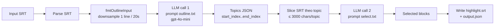

# AI Service (CLI tool)

> Entry: `backend_services/ai_service/index.js` (highlight pipeline) + `quiz.js` (quiz generator) · Node ES modules + OpenAI SDK

**Không phải HTTP service.** Đây là 2 script CLI chạy ad-hoc để thử nghiệm pipeline AI ngoại tuyến trên file `.srt`. Logic production của quiz AI đã được port sang `course_service/src/quizzes/helper/quiz.gen.ts`; logic highlight đã chuyển sang Colab notebooks (gọi qua `inference_service`). File này giữ làm **reference / dev sandbox** để test prompt mà không phải spin Nest.

---

## Cấu trúc

```
ai_service/
├── index.js          # Highlight pipeline: SRT → outline → select → highlight SRT
├── quiz.js           # Quiz generator: SRT + segment map → JSON quiz with cut timestamps
├── prompts/
│   ├── outline.txt   # System prompt cho step 1 (outline topics từ transcript)
│   └── select.txt    # System prompt cho step 2 (chọn block cho highlight)
├── input/            # Sample SRT files (bcnc, dsa, hmt, htf)
├── output/           # Output đã chạy thử (highlight*.srt, output*.json, quiz_1.json)
├── package.json      # 2 deps: dotenv + openai
└── yarn.lock
```

---

## `index.js` — highlight pipeline

Mục tiêu: từ 1 file SRT dài (transcript video), tạo highlight reel `TARGET_MIN`..`TARGET_MAX` giây bằng 2 lần gọi LLM.



Config (`CFG` ở đầu file):

| Key | Default | Mô tả |
|---|---|---|
| `INPUT` | `./input/hmt.srt` | SRT đầu vào |
| `OUTPUT` | `./output/output.json` | Kết quả JSON (segment list) |
| `TOPIC` | (Vd: "Hệ Mặt Trời...") | Subject matter — inject vào prompt outline |
| `INCLUDE` | (Vd các chủ đề được tính) | Để LLM bám sát |
| `EXCLUDE` | (Vd: lời chào, off-topic) | Để LLM loại bỏ |
| `TARGET_MIN` / `TARGET_MAX` | `100` / `300` (giây) | Độ dài highlight mục tiêu |
| `OUTLINE_SAMPLE_EVERY` | `20` (giây) | Step downsample khi build prompt step 1 |
| `SELECT_CHARS_PER_TOPIC` | `3000` | Cap ký tự / topic gửi cho step 2 |
| `MODEL` | `'gpt-4o-mini'` | OpenAI model (gọi `chat.completions.create`, `response_format: json_object`) |
| `MAX_RETRIES` | `2` | Retry mỗi LLM call |
| `GROUP_SEGMENTS` | `false` | Có gom segments liền kề trước khi viết SRT không |

Hai prompt template ở `prompts/outline.txt` và `prompts/select.txt`. Template dùng placeholder `{{TOPIC}}`, `{{INCLUDE}}`, `{{EXCLUDE}}` — script replace bằng giá trị `CFG`.

---

## `quiz.js` — quiz generator (segment-aware)

Mục tiêu: sinh `NUM_QUESTIONS` câu hỏi quiz từ SRT + danh sách segment đã được highlight (`output.json`). Câu hỏi sẽ kèm timestamp tính theo **highlight video** (sau khi cắt) — không phải timestamp gốc.

Pipeline:

1. Đọc `input.srt` (raw transcript) + `output.json` (danh sách segment đã chọn từ `index.js`).
2. `buildSegmentMap`: precompute cho mỗi segment: `originalStart/End` (giây trên video gốc) và `cutStart/End` (cumulative trên highlight cut).
3. Gọi OpenAI để sinh `NUM_QUESTIONS` câu hỏi quanh `TOPIC`.
4. `remapTimestamp`: convert mỗi `timestamp` LLM trả ra (theo original) sang theo highlight cut, snap về biên segment nếu rơi vào gap.
5. Ghi `quiz.json`.

Config:

| Key | Default | Mô tả |
|---|---|---|
| `INPUT_SRT` | `input.srt` | |
| `INPUT_SEGMENTS` | `output.json` | Output của `index.js` |
| `OUTPUT` | `quiz.json` | |
| `TOPIC` | `'JIRA Project Management'` | Subject |
| `NUM_QUESTIONS` | `10` | |
| `MODEL` | `'gpt-4o-mini'` | |
| `MAX_RETRIES` | `2` | |

---

## Environment variables

| Env | Mô tả |
|---|---|
| `OPENAI_API_KEY` (đọc bởi `index.js`) | Token OpenAI |
| `OPENAI_KEY` (đọc bởi `quiz.js`) | **Khác tên** — không nhất quán với `index.js`. Khi chạy `quiz.js` nhớ set `OPENAI_KEY`, không phải `OPENAI_API_KEY` |

> Đề nghị thống nhất sang `OPENAI_API_KEY` khi cleanup.

---

## Run

```bash
cd backend_services/ai_service
yarn install     # hoặc npm install

# Highlight pipeline
node index.js

# Quiz từ output đã có (đặt input.srt và output.json cùng folder)
node quiz.js
```

Không có `package.json` scripts.

---

## Mối quan hệ với production code

| File CLI | Đã port vào | Notes |
|---|---|---|
| `index.js` (outline + select) | Colab notebooks → gọi qua `inference_service` `POST /highlight-reel` | Logic nằm trên Colab, không trong backend Nest |
| `quiz.js` (quiz gen) | `course_service/src/quizzes/helper/quiz.gen.ts` (gọi OpenAI từ Nest) | Phân bố câu hỏi: 60% MCQ / 20% T-F / 20% short |

> Khi cần thay đổi prompt highlight → sửa cả notebook trên Colab. CLI này không tự động sync.

---

## Tips

- **Token quá nhiều** → giảm `SELECT_CHARS_PER_TOPIC` hoặc tăng `OUTLINE_SAMPLE_EVERY` để cắt input.
- **JSON parse fail** → đã có retry; cũng nên kiểm tra prompt có yêu cầu `response_format: { type: 'json_object' }` không.
- **Highlight quá ngắn / quá dài** → chỉnh `TARGET_MIN`/`TARGET_MAX` và viết lại phần kiểm tra `sumDur` ở cuối `index.js`.
- **Test prompt mới** → sửa `prompts/*.txt` rồi chạy CLI là nhanh nhất, sau đó copy vào `quiz.gen.ts` cho production.
