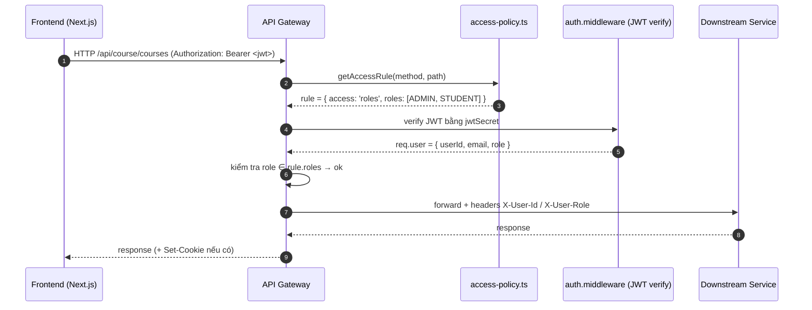
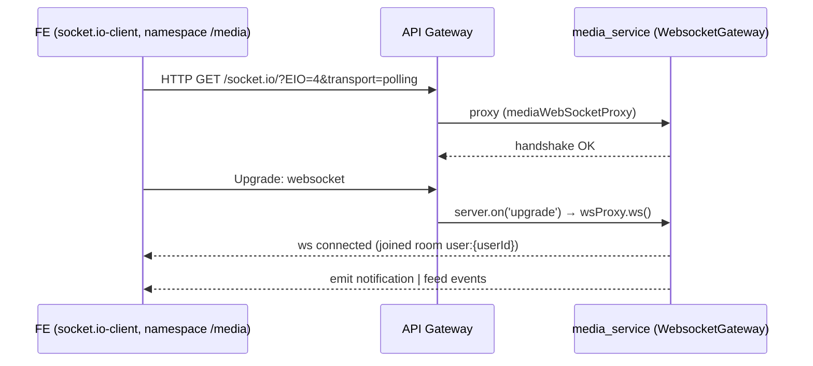

# API Gateway

> Entry: `backend_services/api_gateway/src/index.ts` · Express + TypeScript · Port mặc định `3000`

API Gateway là **cửa duy nhất** mà frontend gọi vào. Nó:

1. Decode JWT, gắn `req.user` và forward các header `X-User-Id`, `X-User-Email`, `X-User-Role` xuống downstream.
2. Áp **chính sách truy cập** (public / authenticated / role-based) theo `access-policy.ts`.
3. Rate-limit các request *mutating* trên `/api/auth` và `/api/media` (POST/PATCH/PUT/DELETE, **bỏ qua** webhook).
4. Proxy theo prefix path tới đúng microservice.
5. Forward WebSocket (`/socket.io`) tới `media_service` để Socket.IO realtime.

---

## Sequence: request có auth điển hình



---

## Pipeline middleware (theo thứ tự trong `src/index.ts`)

| # | Middleware | File | Mục đích |
|---|-----------|------|----------|
| 1 | `cors` (origin = `*`, credentials true) | `index.ts` | Cho phép FE gọi từ mọi origin (research mode) |
| 2 | `express.json` + `urlencoded` | `index.ts` | Parse body |
| 3 | `loggingMiddleware` (morgan combined) | `middleware/logging.middleware.ts` | Log access |
| 4 | `requestLogger` | `middleware/logging.middleware.ts` | Log `method url status duration` mỗi response |
| 5 | `cookieParser` | `index.ts` | Đọc `refreshToken` cookie cho `/api/auth/refresh` |
| 6 | `mediaWebSocketProxy` ở path `/socket.io` | `index.ts` | Proxy handshake Socket.IO → media |
| 7 | `authMutatingRateLimitMiddleware` | `middleware/rate-limit.middleware.ts` | Giới hạn POST/PATCH/PUT/DELETE trên `/api/auth` |
| 8 | `mediaMutatingRateLimitMiddleware` | `middleware/rate-limit.middleware.ts` | Giới hạn mutating trên `/api/media` (trừ `/api/media/webhooks`) |
| 9 | `authorizationMiddleware` | `middleware/authorization.middleware.ts` | Áp `access-policy` + verify JWT khi cần |
| 10 | Header forwarder | `index.ts` | Set `x-user-id`, `x-user-role` từ `req.user` |
| 11 | Route proxies | `routes/*.ts` | http-proxy-middleware tới microservice tương ứng |
| 12 | 404 + error handler | `index.ts` | Fallback chuẩn JSON |

> WebSocket upgrade (`server.on('upgrade')`) gọi `wsProxy.ws(...)` để forward thẳng tới `media_service` (không qua authorization middleware).

---

## Routing table

`config` (`src/config/index.ts`) ánh xạ prefix → service:

| Prefix gateway | File route | Target (`config.services.*`) | Path rewrite |
|---|---|---|---|
| `/api/auth/*` | `routes/auth.routes.ts` | `auth.url` (default `http://localhost:8001`) | `^/api` → `''` |
| `/api/users/*` | `routes/user.routes.ts` | `user.url` (default `http://localhost:8002`) | `^/api` → `''` |
| `/api/course/*` | `routes/course.routes.ts` | `course.url` (default `http://localhost:8008`) | `^/api/course` → `''` |
| `/api/media/*` | `routes/media.routes.ts` | `media.url` (default `http://localhost:8003`) | `^/api/media` → `''` |
| `/api/feed/*` | `routes/feed.routes.ts` | `media.url` | `^/api/feed` → `/feed` |
| `/api/payment/*` | `routes/payment.routes.ts` | `payment.url` (default `http://localhost:8006`) | `^/api/payment` → `''` |
| `/api/mascot_colab/*` | `routes/mascot_colab_routes.ts` | `mascot_colab.url` (default `http://localhost:3005` → inference_service) | `^/api/mascot_colab` → `''` |
| `/socket.io/*` | `index.ts` (proxy trực tiếp) | `media.url` | — |

**Khi proxy:**

- Forward các header: `Content-Type`, `Authorization`, `Cookie`.
- Forward identity: `X-User-Id`, `X-User-Email`, `X-User-Role` (nếu đã có `req.user`).
- Multipart upload (mascot_colab): **không** ghi đè body — để http-proxy stream nguyên bản.

---

## Access policy

Định nghĩa trong `middleware/access-policy.ts` qua mảng `ACCESS_RULES`. Mỗi rule có `method`, `pattern`, `access`, optional `roles`.

```ts
export enum UserRole {
  ADMIN = 1,
  STUDENT = 2,
  LECTURER = 3,
}

type AccessLevel = 'public' | 'authenticated' | 'roles';
```

**Pattern templates:**

- Literal path: `/api/auth/login`
- `:param` matches **một** segment (`/api/users/:id`).
- `*` matches **một** segment bất kỳ.
- `**` matches phần còn lại (rest), ví dụ `/api/media/feed/**`.

**Cách matching:** duyệt `ACCESS_RULES` theo thứ tự khai báo, lấy rule đầu tiên match (method + pattern). Nếu không có rule nào match → 403 `Endpoint access is not configured`.

**Các nhóm rule chính:**

- `/api/auth/*` — `register`, `login`, `google`, `refresh`, `forgot-password`, `check-otp` là `public`. `logout` / `validate` cần authenticated. `issue-token` chỉ ADMIN.
- `/api/users/*` — `profile`, `:id` cần authenticated; list `/` và `reset/:id` chỉ ADMIN. PATCH `/api/users/:id`: ADMIN hoặc chính user đó (kiểm tra trong `authorizationMiddleware`).
- `/api/course/*` — GET phần nhiều public hoặc authenticated; mutating chia theo role (`LECTURER`, `ADMIN`, có khi `STUDENT` cho enroll/feedback/cart).
- `/api/media/*` — `webhooks/*` và `sse/*` là public; còn lại authenticated, feed `*` có một số stat endpoint chỉ ADMIN/LECTURER.
- `/api/payment/*` — `payos-callback`, `return`, `cancel`, `order-status/:orderCode` là public; `create-payment`, `buy-now`, `transactions*` cần authenticated.
- `/api/mascot_colab/**` — toàn bộ cần authenticated.

> Bổ sung rule mới: chèn vào đúng vị trí trong `ACCESS_RULES` (rule cụ thể hơn phải đặt **trước** rule tổng quát).

---

## Rate limiting

`middleware/rate-limit.middleware.ts` cấu hình 2 limiter:

| Limiter | Áp dụng cho | Window | Max |
|---|---|---|---|
| `authMutatingRateLimitMiddleware` | `/api/auth/*` + `POST/PATCH/PUT/DELETE` | `RATE_LIMIT_WINDOW_MS` (mặc định 900_000ms = 15 phút) | `RATE_LIMIT_AUTH_MUTATING_MAX` (mặc định 100) |
| `mediaMutatingRateLimitMiddleware` | Mutating bất kỳ **trừ** `/api/media/webhooks/*` | như trên | `RATE_LIMIT_MEDIA_MUTATING_MAX` (mặc định 100) |

GET hoàn toàn không bị rate-limit ở gateway.

---

## WebSocket proxy (`/socket.io`)



---

## Environment variables (xem `src/config/index.ts`)

| Env | Mặc định | Mô tả |
|---|---|---|
| `PORT` | `3000` | Port gateway |
| `JWT_SECRET` | `your-secret-key-change-in-production` | Phải khớp với `auth_service` |
| `AUTH_SERVICE_URL` | `http://localhost:8001` | URL `auth_service` |
| `USER_SERVICE_URL` | `http://localhost:8002` | URL `user_service` |
| `COURSE_SERVICE_URL` | `http://localhost:8008` | URL `course_service` |
| `MEDIA_SERVICE_URL` | `http://localhost:8003` | URL `media_service` |
| `PAYMENT_SERVICE_URL` | `http://localhost:8006` | URL `payment_service` |
| `MASCOT_COLAB_SERVICE_URL` | `http://localhost:3005` | URL `inference_service` |
| `RATE_LIMIT_WINDOW_MS` | `900000` | Window rate limit (ms) |
| `RATE_LIMIT_MAX` | `100` | Fallback max chung |
| `RATE_LIMIT_AUTH_MUTATING_MAX` | `RATE_LIMIT_MAX` | Cap auth mutating |
| `RATE_LIMIT_MEDIA_MUTATING_MAX` | `RATE_LIMIT_MAX` | Cap media mutating |

---

## Scripts (`package.json`)

```bash
yarn dev    # ts-node-dev --respawn src/index.ts
yarn build  # tsc → dist/
yarn start  # node dist/index.js
yarn lint
```

---

## Tips khi sửa gateway

- **Thêm endpoint mới** → bắt buộc thêm rule vào `ACCESS_RULES`, nếu không sẽ bị 403.
- **Đổi prefix** → sửa cả `pathRewrite` của route tương ứng và mọi rule có pattern `^/api/<prefix>/...`.
- **Webhook public** → đảm bảo `access: 'public'` và path không khớp `mediaMutatingRateLimitMiddleware` (đường `/api/media/webhooks/*` được loại trừ trong code).
- **Debug 403** → check thứ tự rule, regex pattern (`compilePathPattern`), và verify token có valid không (`/api/auth/validate`).
- **Health** → `GET /health`.
