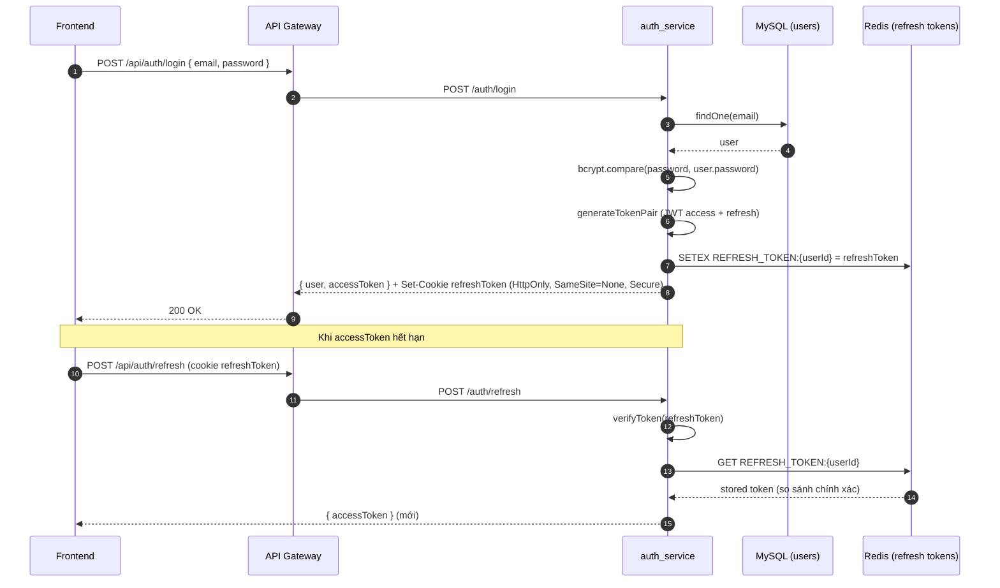
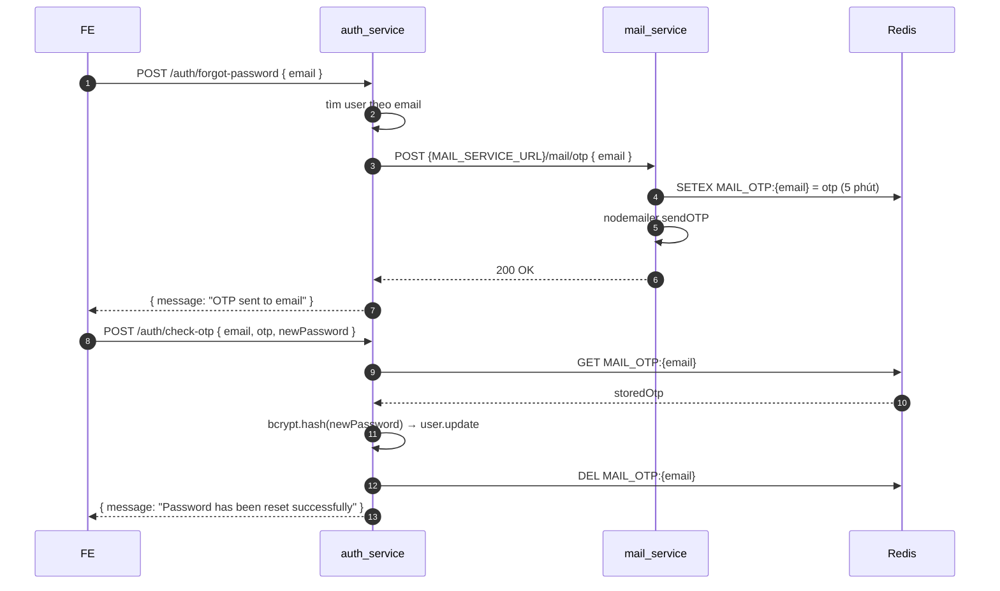

# Auth Service

> Entry: `backend_services/auth_service/src/main.ts` · NestJS · Port mặc định `8001`

Chịu trách nhiệm authentication và phát hành JWT cho toàn hệ thống:

- Đăng ký / đăng nhập bằng email-password.
- Đăng nhập Google OAuth (verify Google ID token bằng `google-auth-library`).
- Phát hành cặp `accessToken` + `refreshToken` (lưu refresh ở Redis + HTTP-only cookie).
- Refresh access token bằng cookie.
- Forgot password qua OTP (gọi `mail_service` để gửi email, OTP key trong Redis).
- Validate token cho các service khác (sanity check ngoài gateway).

---

## Sequence: login + refresh



---

## Module tree

```
src/
├── main.ts                       # bootstrap, CORS theo CORS_ORIGINS, cookieParser
├── app.module.ts                 # ConfigModule (db/redis/jwt) + DatabaseModule + AuthModule
├── auth/
│   ├── auth.controller.ts        # routes /auth/*
│   ├── auth.service.ts           # business logic
│   ├── auth.module.ts            # imports UsersModule, JwtTokenModule, RedisModule, HttpModule
│   ├── constants/cookie.constant.ts
│   ├── dto/                      # RegisterDto, LoginDto, GoogleLoginDto, ValidateTokenDto, ForgotPasswordDto, CheckOtpDto, RefreshTokenDto
│   └── jwt/                      # JwtTokenService + JwtAuthGuard
├── users/
│   ├── user.model.ts             # Sequelize model `users`
│   └── users.module.ts
├── redis/                        # RedisService (ioredis)
├── database/                     # DatabaseModule (sequelize-typescript)
└── config/
    ├── database.config.ts
    ├── jwt.config.ts
    └── redis.config.ts
```

---

## Endpoints (`@Controller('auth')`)

| Method | Path | Access (gateway) | DTO | Service handler |
|---|---|---|---|---|
| POST | `/auth/register` | public | `RegisterDto` { email, password, firstName?, lastName? } | `AuthService.register` — bcrypt hash, role mặc định `2 (STUDENT)` |
| POST | `/auth/login` | public | `LoginDto` { email, password } | `AuthService.login` → issueAuthTokens |
| POST | `/auth/google` | public | `GoogleLoginDto` { credential } | Verify ID token Google, tạo user mới nếu chưa có (`googleId`, `emailVerified=true`, `avatarUrl`) |
| POST | `/auth/refresh` | public | (cookie `refreshToken`) | Trả `accessToken` mới |
| POST | `/auth/logout` | authenticated (JwtAuthGuard) | — | `redis.del(REFRESH_TOKEN:{userId})` + clear cookie |
| POST | `/auth/validate` | authenticated | `ValidateTokenDto` { token } | Trả `{ valid, payload? \| reason }` |
| POST | `/auth/issue-token` | ADMIN | { userId, email, role } | Phát hành cặp token mới (impersonate / system) |
| POST | `/auth/forgot-password` | public | `ForgotPasswordDto` { email } | Gọi `POST {MAIL_SERVICE_URL}/mail/otp { email }` |
| POST | `/auth/check-otp` | public | `CheckOtpDto` { email, otp, newPassword } | So OTP với key Redis `MAIL_OTP:{email}` → reset password, xoá OTP |

> Tất cả handler chạy qua global `ValidationPipe({ whitelist, forbidNonWhitelisted, transform })` ở `main.ts`.

---

## Cookie `refreshToken`

`src/auth/constants/cookie.constant.ts`:

```ts
export const COOKIE_CONFIG = {
  REFRESH_TOKEN_NAME: 'refreshToken',
  REFRESH_TOKEN_OPTIONS: {
    httpOnly: true,
    secure: true,            // SameSite=None bắt buộc secure
    sameSite: 'none',        // cross-site (localhost FE → ngrok BE)
    maxAge: 7 * 24 * 60 * 60 * 1000, // 7 ngày
    path: '/',
  },
};
```

> Khi chạy local thuần HTTP, cookie này có thể không được browser gửi lên Next.js server-side. Gateway/proxy luôn forward `Cookie` header, refresh chạy qua trình duyệt là ổn.

---

## Token strategy

- `JwtTokenService` (`src/auth/jwt/jwt.service.ts`) tạo JWT bằng `@nestjs/jwt` với secret `jwt.secret`.
- Payload: `{ userId, email, role }`.
- `accessToken` mặc định 15 phút (`JWT_ACCESS_EXPIRES_IN=15m`).
- `refreshToken` mặc định 7 ngày (`JWT_REFRESH_EXPIRES_IN=7d`).
- Mỗi lần login/refresh issue → ghi đè key `REFRESH_TOKEN:{userId}` trong Redis (TTL = `REDIS_TTL`, mặc định 7 ngày).
- Logout xoá key này → refresh sẽ thất bại 401 `Refresh token not found or expired`.

---

## Sequence: forgot password



> Lưu ý: key OTP do `mail_service` set với prefix `MAIL_OTP:` — `auth_service` chỉ đọc/xoá.

---

## Bảng `users` (model `User`)

```
id              INT PK auto
email           VARCHAR(100) UNIQUE NOT NULL
password        VARCHAR(255) NULLABLE          # null nếu chỉ login Google
firstName       VARCHAR(100)
lastName        VARCHAR(100)
role            INT                            # 1 ADMIN | 2 STUDENT (default) | 3 LECTURER
googleId        VARCHAR(255) UNIQUE NULLABLE
emailVerified   BOOLEAN DEFAULT false
avatarUrl       VARCHAR(500)
createdAt, updatedAt
```

> `auth_service` chia sẻ bảng `users` với `user_service` (cùng DB, cùng tên cột — không có migration riêng).

---

## Environment variables

| Env | Mặc định | Mô tả |
|---|---|---|
| `PORT` | `8001` | Port service |
| `CORS_ORIGINS` | `''` | Danh sách origin được phép (comma-separated). Request không có Origin (Postman) luôn được phép |
| `JWT_SECRET` | `your-secret-key-change-in-production` | Phải khớp gateway |
| `JWT_ACCESS_EXPIRES_IN` | `15m` | TTL access token |
| `JWT_REFRESH_EXPIRES_IN` | `7d` | TTL refresh token |
| `DB_HOST` | `localhost` | MySQL host |
| `DB_PORT` | `3306` | MySQL port |
| `DB_USERNAME` | `graduation_user` | |
| `DB_PASSWORD` | `graduation_password` | |
| `DB_DATABASE` | `graduation_db` | |
| `REDIS_HOST` | `localhost` | |
| `REDIS_PORT` | `6379` | |
| `REDIS_PASSWORD` | `undefined` | |
| `REDIS_DB` | `0` | |
| `REDIS_TTL` | `604800` (7 ngày) | TTL mặc định cho `RedisService.set` (refresh token) |
| `MAIL_SERVICE_URL` | `http://localhost:3000` | URL `mail_service` cho forgot-password |

---

## Scripts

```bash
yarn start:dev     # nest start --watch
yarn build         # nest build
yarn start:prod    # node dist/main
yarn test
yarn lint
```

---

## Tips

- **401 ngay sau login** → check `JWT_SECRET` đồng bộ giữa `auth_service` và `api_gateway`. Mỗi nơi đọc env khác nhau, sai 1 ký tự là 401.
- **Refresh trả 401** → kiểm tra key `REFRESH_TOKEN:{userId}` trong Redis còn không (TTL có thể expire), và cookie có được gửi không (`sameSite=none` cần HTTPS).
- **Google login lỗi `Google email is not verified`** → ID token thật từ Google nhưng email chưa verified, phải dùng tài khoản khác.
- **Forgot password không thấy email** → check `mail_service` log, key `MAIL_OTP:{email}` trong Redis, và `MAIL_*` env.
