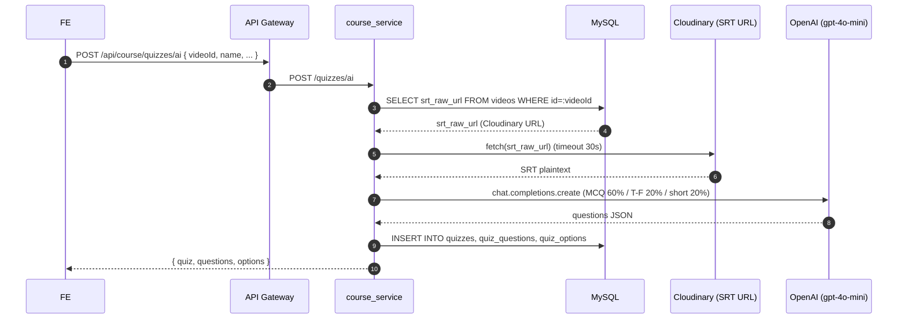
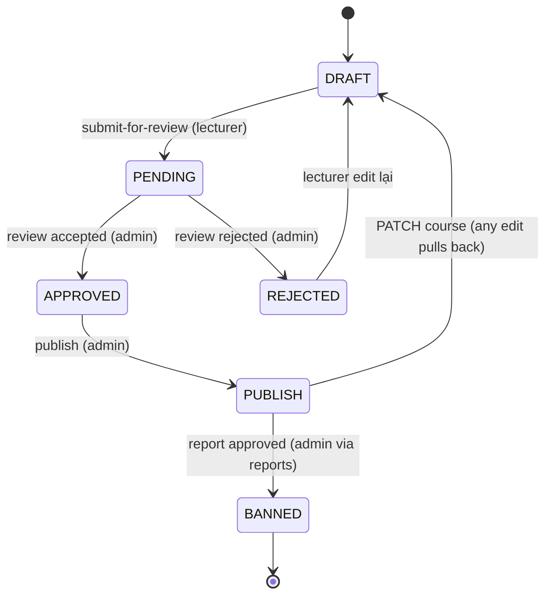

# Course Service

> Entry: `backend_services/course_service/src/main.ts` · NestJS · Port mặc định `8008`

Service trung tâm của LMS. Quản lý toàn bộ vòng đời nội dung học tập:

- Course (workflow draft → pending → approved → publish/rejected → banned)
- Lesson + LessonActivity (gồm Quiz embedded)
- Quiz (thủ công + AI generate từ SRT)
- Enroll + LessonProgress
- Cart + CartItem (giỏ hàng course)
- Roadmap + RoadmapCourse (lộ trình học có thứ tự)
- Feedback + FeedbackReaction
- Report (báo cáo course/lesson/teacher → ADMIN duyệt)

Service nhận identity qua header `X-User-Id` / `X-User-Email` / `X-User-Role` từ gateway, không tự verify JWT.

---

## Sequence: tạo quiz bằng AI từ video SRT



> `srt_raw_url` được set bởi webhook Cloudinary (xem `media_service/webhook`). Course service chỉ là consumer.

---

## Module tree (mỗi feature 1 Nest module)

```
src/
├── main.ts
├── app.module.ts             # import all feature modules
├── config/                   # database.config, jwt.config
├── database/                 # DatabaseModule (sequelize-typescript)
├── users/                    # User model (đọc-only, dùng cho join)
├── models/                   # các Sequelize model dùng chung
├── course/                   # Course CRUD + review workflow
├── lessons/                  # Lesson CRUD
├── lessonActivities/         # LessonActivity (quiz-in-lesson)
├── lessonProgress/           # tiến độ học của user
├── quizzes/                  # Quiz CRUD + AI generation (OpenAI)
│   ├── helper/quiz.gen.ts    # gọi OpenAI gpt-4o-mini
│   ├── resolve-srt.ts        # fetch SRT từ Cloudinary URL
│   └── quiz-payload.mapper.ts
├── enrolls/                  # Enroll + check-mine-exists
├── carts/                    # Giỏ hàng (1 cart / user)
├── roadmaps/                 # Lộ trình học (ordered courses)
├── feedbacks/                # Feedback per course
├── feedback-reactions/       # Like/Dislike feedback
└── reports/                  # Báo cáo course/lesson/teacher
```

---

## Endpoints

### Course (`@Controller('courses')`)

| Method | Path | Access (gateway) | Mô tả |
|---|---|---|---|
| POST | `/courses` | LECTURER, ADMIN | Tạo course mới (status mặc định `DRAFT`) |
| GET | `/courses/mine` | authenticated | Course của chính lecturer |
| GET | `/courses` | ADMIN, STUDENT | List có filter `status`, paging |
| GET | `/courses/stats/overview` | ADMIN, LECTURER | Thống kê tổng |
| GET | `/courses/:id/stats/overview` | ADMIN, LECTURER | Thống kê 1 course (enrolls active/completed) |
| GET | `/courses/:id` | public | Detail (kèm lessons) |
| PATCH | `/courses/:id` | LECTURER, ADMIN | Update — nếu `status === PUBLISH` thì update kéo về `DRAFT` |
| DELETE | `/courses/:id` | ADMIN | Soft/hard delete tuỳ logic |
| POST | `/courses/:id/submit-for-review` | LECTURER | DRAFT → PENDING |
| POST | `/courses/:id/review` | ADMIN | PENDING → APPROVED / REJECTED |
| POST | `/courses/:id/publish` | ADMIN | APPROVED → PUBLISH |

**Course status flow:**



### Lesson (`@Controller('lessons')`)

| Method | Path | Access | Mô tả |
|---|---|---|---|
| POST | `/lessons` | LECTURER, ADMIN | Tạo lesson |
| GET | `/lessons/course` | public | List lesson của course (query `courseId`) |
| GET | `/lessons/:id` | public | Detail lesson (kèm video) |
| PATCH | `/lessons/:id` | LECTURER, ADMIN | Update |
| DELETE | `/lessons/:id` | LECTURER, ADMIN | Soft delete (status `REMOVED`) |

### Quiz (`@Controller('quizzes')`)

| Method | Path | Access | Mô tả |
|---|---|---|---|
| POST | `/quizzes` | LECTURER, ADMIN | Body có thể là object hoặc array (createMany) |
| POST | `/quizzes/ai` | LECTURER, ADMIN | Sinh quiz từ SRT của video (OpenAI gpt-4o-mini, 60% MCQ / 20% T-F / 20% short) |
| GET | `/quizzes` | public | Filter `lessonActivityId`, `type=in_video\|after_video` |
| GET | `/quizzes/lesson/:lessonId` | authenticated | Quiz theo lesson |
| GET | `/quizzes/:id` | authenticated | Detail (kèm questions + options) |
| PATCH | `/quizzes/:id` | LECTURER, ADMIN | Update (replace questions/options) |
| DELETE | `/quizzes/:id` | LECTURER, ADMIN | |

### Lesson Activity (`@Controller('lesson-activities')`)

| Method | Path | Access | Mô tả |
|---|---|---|---|
| POST | `/lesson-activities` | LECTURER, ADMIN | |
| GET | `/lesson-activities` | authenticated | Filter |
| GET | `/lesson-activities/user` | authenticated | Của user hiện tại |
| GET | `/lesson-activities/:id` | authenticated | Detail |
| PATCH | `/lesson-activities/:id` | LECTURER, ADMIN | |
| DELETE | `/lesson-activities/:id` | LECTURER, ADMIN | |

### Lesson Progress (`@Controller('lesson-progress')`)

| Method | Path | Access | Mô tả |
|---|---|---|---|
| POST | `/lesson-progress` | ADMIN, LECTURER | Tạo bản ghi tiến độ (thường do system tạo qua FE) |
| GET | `/lesson-progress` | authenticated | List của user hiện tại |
| GET | `/lesson-progress/:id` | authenticated | |
| PATCH | `/lesson-progress/:id` | ADMIN, LECTURER | Update (FE thường call PATCH khi video xem xong) |
| DELETE | `/lesson-progress/:id` | ADMIN, LECTURER | |

### Enroll (`@Controller('enroll')`)

| Method | Path | Access | Mô tả |
|---|---|---|---|
| POST | `/enroll` | STUDENT, LECTURER, ADMIN | Body `{ courseId }`. `payment_service` cũng gọi endpoint này sau khi PayOS xác nhận |
| GET | `/enroll` | authenticated | List enroll của user |
| GET | `/enroll/check-mine-exists` | authenticated | `{ courseId }` → boolean |
| GET | `/enroll/:id` | authenticated | |
| PATCH | `/enroll/:id` | LECTURER, ADMIN | |
| DELETE | `/enroll/:id` | ADMIN | |

### Cart (`@Controller('carts')`)

| Method | Path | Access | Mô tả |
|---|---|---|---|
| GET | `/carts` | authenticated | Cart của user (auto tạo nếu chưa có) |
| POST | `/carts/items` | authenticated | Thêm course vào cart |
| DELETE | `/carts/items/:courseId` | authenticated | Xoá 1 item. `payment_service` gọi endpoint này sau thanh toán thành công |
| DELETE | `/carts` | authenticated | Empty cart |

### Roadmap (`@Controller('roadmaps')`)

| Method | Path | Access | Mô tả |
|---|---|---|---|
| POST | `/roadmaps` | LECTURER, ADMIN | |
| GET | `/roadmaps` | public | List |
| GET | `/roadmaps/:id` | public | Detail (kèm danh sách course đã sắp xếp) |
| PATCH | `/roadmaps/:id` | LECTURER, ADMIN | |
| DELETE | `/roadmaps/:id` | LECTURER, ADMIN | |
| POST | `/roadmaps/:id/courses` | LECTURER, ADMIN | Thêm course vào roadmap |
| POST | `/roadmaps/:id/courses/bulk` | LECTURER, ADMIN | Bulk-add |
| PATCH | `/roadmaps/:id/courses/reorder` | LECTURER, ADMIN | Đổi thứ tự (drag & drop) |
| PATCH | `/roadmaps/:id/courses/:courseId` | LECTURER, ADMIN | Update entry |
| DELETE | `/roadmaps/:id/courses/:courseId` | LECTURER, ADMIN | |

### Feedback (`@Controller('feedbacks')`)

| Method | Path | Access | Mô tả |
|---|---|---|---|
| POST | `/feedbacks` | STUDENT, LECTURER, ADMIN | Tạo (1 user / course) |
| GET | `/feedbacks/check/:courseId` | (theo policy `feedbacks/**` public) | Check đã feedback chưa |
| GET | `/feedbacks/:courseId` | public | List feedback của course |
| PATCH | `/feedbacks/:id` | ADMIN | |
| DELETE | `/feedbacks/:id` | ADMIN | |

### Feedback Reactions (`@Controller('feedback-reactions')`)

| Method | Path | Access | Mô tả |
|---|---|---|---|
| POST | `/feedback-reactions` | STUDENT, LECTURER, ADMIN | Like / dislike |
| DELETE | `/feedback-reactions/feedback/:feedbackId` | STUDENT, LECTURER, ADMIN | Bỏ react |
| GET | `/feedback-reactions/feedback/:feedbackId` | public | Đếm reactions |

### Reports (`@Controller('reports')`)

| Method | Path | Access | Mô tả |
|---|---|---|---|
| POST | `/reports` | STUDENT, LECTURER, ADMIN | Báo cáo `targetType` ∈ `teacher` / `course` / `lesson` |
| GET | `/reports/mine` | authenticated | Báo cáo của user |
| GET | `/reports` | ADMIN | List tất cả |
| GET | `/reports/:id` | ADMIN | Detail |
| PATCH | `/reports/:id/review` | ADMIN | `approved` → ban target (set `is_banned` user hoặc `status=BANNED` course/lesson); `rejected` |

---

## Enum quan trọng

```ts
// models/course.model.ts
export enum CourseStatus { DRAFT='draft', PENDING='pending', APPROVED='approved', REJECTED='rejected', PUBLISH='publish', BANNED='banned' }
export enum CourseLevel  { BEGINNER='Beginner', INTERMEDIATE='Intermediate', ADVANCED='Advanced' }

// models/enroll.model.ts
export enum EnrollStatus { ACTIVE='active', COMPLETED='completed', DROPPED='dropped' }

// models/lesson.model.ts
export enum LessonStatus { ACTIVE='active', REMOVED='removed', BLOCKED='blocked' }
export enum ContentType  { VIDEO='video', TEXT='text' }

// models/report.model.ts
export enum ReportTargetType { TEACHER='teacher', COURSE='course', LESSON='lesson' }
export enum ReportStatus     { PENDING='pending', APPROVED='approved', REJECTED='rejected' }
```

---

## Quiz AI: pipeline

```
videoId
  └── SELECT srt_raw_url FROM videos
        └── resolveSrtRawForQuiz()
              ├── nếu là URL → fetch (timeout 30s)
              └── nếu là inline text → dùng luôn
                    └── generateQuizPayload(srt, name, opts)
                          └── helper/quiz.gen.ts: OpenAI gpt-4o-mini
                                ├── PCT_MCQ = 60
                                ├── PCT_TRUE_FALSE = 20
                                └── PCT_SHORT_TEXT = 20
```

> Yêu cầu env `OPENAI_API_KEY` ở `course_service`.

---

## Cross-service dependencies

| Bên gọi | Endpoint | Khi nào |
|---|---|---|
| `payment_service` | `POST /enroll` | Sau khi PayOS webhook trả PAID → enroll user vào course |
| `payment_service` | `DELETE /carts/items/:courseId` | Dọn cart sau khi mua thành công |
| `media_service` | `srt_raw_url` (Cloudinary webhook ghi vào DB videos qua `course_service` migrations / shared DB) | Khi upload SRT |

Course service **không** gọi service khác qua HTTP (zero outbound). Quiz AI gọi thẳng OpenAI.

---

## Environment variables

| Env | Mặc định | Mô tả |
|---|---|---|
| `PORT` | `8008` | Port |
| `DB_*` | như auth_service | MySQL shared |
| `OPENAI_API_KEY` | — | Bắt buộc cho `POST /quizzes/ai` |
| `JWT_SECRET`, `JWT_*_EXPIRES_IN` | (load nhưng chỉ verify khi service standalone, gateway luôn pre-verify) | |

---

## Scripts

```bash
yarn start:dev
yarn build
yarn start:prod
```

---

## Tips

- **AI quiz báo `Could not load SRT content`** → video chưa có `srt_raw_url` (Cloudinary webhook chưa chạy), hoặc URL hết hạn.
- **Edit course xong nhảy về DRAFT** → đúng logic: `course.service.update` reset về DRAFT khi `status === PUBLISH`. Muốn giữ status phải qua workflow review lại.
- **Enroll thất bại** → check user có trong DB không, course `PUBLISH` chưa, đã enroll trước đó chưa (`check-mine-exists`).
- **Filter `type=in_video`/`after_video`** trong quiz: validate ở controller, sai value sẽ 400 `BadRequestException`.
- **Report duyệt nhưng course không bị ban** → kiểm tra `reports.service.ts` logic cập nhật `courses.status = BANNED` / `users.is_banned = true`.
