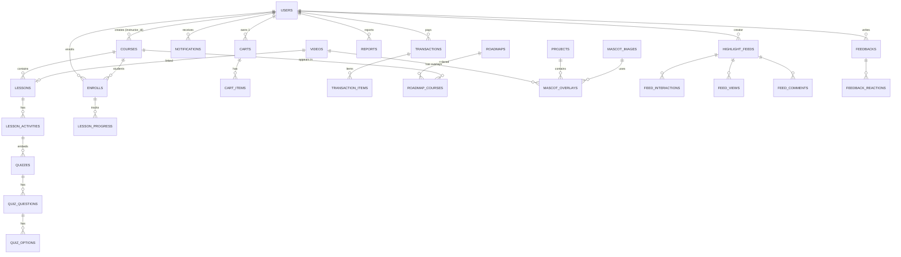

# Database & Migrations

> Root: `database/` · MySQL 8 · Knex 3.1

Tập trung schema MySQL + migration ở **1 nơi duy nhất**. Tất cả backend services connect chung 1 database `graduation_db` nhưng **không** chứa migration của riêng mình — chỉ định nghĩa Sequelize model để đọc/ghi.

Quan trọng:

- `database/migrations/initial_schema.sql` là **mốc gốc** (snapshot of legacy 001–008).
- `database/knex_migrations/001_initial_schema.js` chỉ chạy SQL ở trên khi bảng `users` chưa tồn tại.
- Mọi thay đổi schema **sau đó** → tạo file `XXX_<desc>.js` mới trong `knex_migrations/`. Không sửa `initial_schema.sql` trừ khi quyết định reset mốc.

---

## Stack

```
database/
├── knexfile.js                   # config 2 env: development + railway (cùng dùng mysql2)
├── package.json                  # scripts knex
├── knex_migrations/              # các file migration Knex (đã chạy được tracking)
│   ├── 001_initial_schema.js     # bootstrap toàn bộ schema từ SQL gốc
│   ├── 002 .. 022_*.js           # các migration tăng dần
├── migrations/                   # SQL legacy (initial_schema.sql, transaction_tables.sql, seed_data.sql, ...)
├── helpers/_legacy_sql.js
├── seeds/01_init.js              # placeholder seed
└── db_dump.sql / db_dump.dbml    # dump để vẽ ERD
```

`knexfile.js`:

```js
{
  development: {
    client: 'mysql2',
    connection: {
      host: env.DB_HOST ?? '127.0.0.1',
      port: env.DB_PORT ?? 3306,
      user: env.DB_USER ?? 'graduation_user',
      password: env.DB_PASSWORD ?? 'graduation_password',
      database: env.DB_NAME ?? 'graduation_db',
      multipleStatements: true,        // cần cho initial_schema.sql
    },
    migrations: { directory: './knex_migrations', tableName: 'knex_migrations' },
  },
  railway: { /* tương tự, host = Railway proxy */ }
}
```

> Lưu ý các service Nest dùng env `DB_USERNAME` / `DB_DATABASE`, còn `knexfile.js` đọc `DB_USER` / `DB_NAME`. Khi viết `.env` chung phải **set cả 2 tên**.

---

## Workflow

```bash
cd database
yarn install

# Tạo DB / bảng lần đầu (DB còn trống):
yarn migrate                # = knex migrate:latest --env development
# 001_initial_schema.js → chạy initial_schema.sql → tạo toàn bộ bảng legacy
# 002..022_*.js          → áp thêm tăng dần

# Trạng thái migration:
yarn migrate:status         # current version
yarn migrate:list           # done vs pending

# Rollback step gần nhất:
yarn migrate:rollback

# Production (Railway):
yarn migrate:railway
```

Thêm migration mới:

```bash
# Convention: tăng số thứ tự, snake_case mô tả
# database/knex_migrations/023_videos_add_thumbnail.js
exports.up = async function (knex) {
  await knex.schema.alterTable('videos', t => {
    t.string('thumbnail_url', 500).nullable();
  });
};
exports.down = async function (knex) {
  await knex.schema.alterTable('videos', t => t.dropColumn('thumbnail_url'));
};
```

---

## Migration timeline

| File | Đụng vào | Mô tả ngắn |
|---|---|---|
| `001_initial_schema.js` | tất cả bảng legacy (roles, users, mascot_*, videos, projects, lessons, lesson_activities, quizzes, quiz_questions, quiz_options) | Idempotent bootstrap qua `initial_schema.sql` |
| `002_videos_job_id_unique.js` | `videos` | Add UNIQUE constraint `job_id` |
| `003_courses_table.js` | `courses` | Create table course (status enum draft/pending/approved/rejected/publish/banned) |
| `004_transaction_tables.js` | `transactions`, `transaction_items` | Cho `payment_service` |
| `005_roadmaps_tables.js` | `roadmaps`, `roadmap_courses` | Lộ trình học |
| `006_enrolls_and_lesson_progress.js` | `enrolls`, `lesson_progress` | |
| `007_quiz_video_columns.js` | `quizzes`, `videos` | Liên kết quiz ↔ video, `srt_raw_url` |
| `008_course_feedback_tables.js` | `feedbacks`, `feedback_reactions` | |
| `009_highlight_feed_tables.js` | `highlight_feeds`, `feed_interactions`, `feed_views` | Newsfeed |
| `010_cart_and_cart_item.js` | `carts`, `cart_items` | |
| `011_modify_quiz-question_video-timestamp.js` | `quiz_questions` | Đổi kiểu cột timestamp |
| `012_feed_comments_table.js` | `feed_comments` | |
| `012_modify_lessons_duration_time3.js` | `lessons` | Cột duration |
| `013_videos_long_bunny_guid.js` | `videos` | Thêm `bunny_video_guid` (loại video LONG) |
| `014_lesson_progress_add_video_completed_status.js` | `lesson_progress` | Cột video_completed |
| `015_feed_comments_add_origin_cmt.js` | `feed_comments` | Reply nguồn |
| `016_courses_description_to_text.js` | `courses` | VARCHAR → TEXT |
| `017_courses_add_video_id.js` | `courses` | FK video preview |
| `018_highlight_feed_add_caption.js` | `highlight_feeds` | |
| `019_notifications_table.js` | `notifications` | Tất cả notification DB-backed |
| `019_users_add_avatar_url.js` | `users` | `avatar_url` |
| `020_mascot_images_cloudinary_columns.js` | `mascot_images` | Cloudinary public_id, url |
| `020_reports_and_ban_columns.js` | `reports`, `users.is_banned`, `courses.status='banned'`, `lessons.status='blocked'` | Module Reports |
| `021_notifications_event_source_mysql_enum.js` | `notifications` | Enum chuẩn hoá |
| `021_reports_add_deleted_at.js` | `reports` | Soft delete (paranoid) |
| `022_users_google_oauth.js` | `users` | `google_id` unique, `email_verified` boolean |

> Có 2 cặp file dùng cùng số (`012_`, `019_`, `020_`, `021_`) — Knex chạy theo thứ tự alphabet của filename, không phải số riêng. Đặt tên phải bảo đảm thứ tự đúng.

---

## Schema overview (nhóm theo service)



### Bảng theo nhóm

| Nhóm | Bảng | Service primary owner |
|---|---|---|
| Identity | `roles`, `users` | auth_service / user_service |
| Course | `courses`, `lessons`, `lesson_activities`, `quizzes`, `quiz_questions`, `quiz_options` | course_service |
| Enroll | `enrolls`, `lesson_progress` | course_service |
| Cart | `carts`, `cart_items` | course_service |
| Roadmap | `roadmaps`, `roadmap_courses` | course_service |
| Feedback | `feedbacks`, `feedback_reactions` | course_service |
| Report | `reports` | course_service |
| Payment | `transactions`, `transaction_items` | payment_service |
| Media | `videos`, `mascot_images`, `mascot_overlays`, `projects` | media_service |
| Feed | `highlight_feeds`, `feed_interactions`, `feed_views`, `feed_comments` | media_service |
| Notify | `notifications` | media_service |

---

## Conventions

- Bảng dùng `snake_case` (`feed_comments`, `lesson_activities`).
- Sequelize model decoration thường có `field: 'snake_case'` mapping sang `camelCase` ts (vd `user_id` → `userId`).
- Hầu hết bảng có `created_at` / `updated_at` (Sequelize `timestamps: true` + `createdAt: 'created_at'`).
- `reports` dùng `paranoid: true` + `deletedAt: 'deleted_at'` (soft delete).
- Enum lưu kiểu MySQL `ENUM('a','b','c')` — phải khớp với TypeScript enum trong code Nest.

---

## Tips

- **`knex migrate:latest` báo trùng bảng** → bạn đã chạy tay SQL trước rồi; xoá bảng `knex_migrations` để Knex bootstrap lại, hoặc INSERT row đầu tiên tay vào `knex_migrations` để skip 001.
- **Connection refused** → check Docker MySQL `docker-compose up -d`, port 3306, network namespace.
- **`multipleStatements` không bật** → migration 001 sẽ fail vì SQL gộp nhiều `CREATE TABLE`. `knexfile.js` đã bật sẵn.
- **Đổi enum cần migration** → MySQL không hỗ trợ ALTER enum tăng dần, phải `ALTER TABLE ... MODIFY COLUMN status ENUM(...)`.
- **Railway** → dùng `yarn migrate:railway`. Connection string ở `knexfile.js > railway`, host trỏ proxy `*.proxy.rlwy.net`.
- **Seed** → folder `seeds/` hiện chỉ có placeholder; chưa có seed production-ready.
