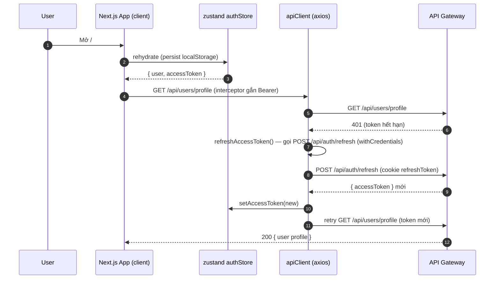

# Frontend Next.js

> Entry: `frontend-nextjs/app/layout.tsx` · Next.js 16 (App Router) · React 19 · TypeScript

Web app chính cho 3 role: **Student**, **Lecturer**, **Admin**. Stack:

- Next.js 16 App Router (client-side routing, App folder `/app`).
- React 19 + Tailwind v4.
- Radix UI primitives (shadcn-style components, folder `components/ui`).
- TanStack Query (`@tanstack/react-query`) cho server state.
- Zustand (`store/auth.ts`, `store/ui-mode.ts`) cho client state, có `persist` để keep accessToken.
- Axios `apiClient` (`lib/http.ts`) — interceptor auto refresh token.
- Socket.IO client cho realtime, namespace `/media`.
- CKEditor + Tiptap cho rich-text.

---

## Sequence: bootstrap + auth refresh interceptor



---

## Folder structure

```
frontend-nextjs/
├── app/                       # App Router (Next.js 16)
│   ├── layout.tsx             # Root layout (ThemeProvider, AuthProvider, QueryProvider)
│   ├── globals.css            # Tailwind v4 entry
│   ├── (auth)/                # signin / signup / forgot-password / reset-password
│   ├── (app)/                 # User app: courses, library, cart, payment, profile, workspace, upload
│   ├── (admin)/               # admin/* — dashboard, users, courses, reports
│   ├── (instructor)/          # instructor/* — dashboard, courses, analytics, shorts, roadmaps, qa
│   ├── editor/                # Mascot overlay editor
│   └── newsfeed/              # Short-video feed
│
├── components/
│   ├── ui/                    # shadcn primitives (button, dialog, ...)
│   ├── providers/             # AuthProvider, QueryProvider, ThemeProvider
│   ├── Header / Footer / ProtectedRoute / RoleGuard / PageLoader / ThemeToggle
│   ├── RichTextBoxCKE.tsx     # CKEditor wrapper
│   ├── RichTextBoxTiptap.tsx  # Tiptap wrapper
│   └── DraggableItem.tsx
│
├── features/                  # Feature-first modules
│   ├── _shared/               # cross-feature helpers
│   ├── auth/                  # signin/up forms, OAuth Google flow
│   ├── courses/               # api/, detail/, learn/, types, utils
│   ├── lessons/               # api/, types
│   ├── quizzes/
│   ├── newsfeed/              # api, components, hooks, store, types
│   ├── notifications/         # Socket.IO + SSE consumer
│   ├── cart/, payment/        # PayOS checkout flow
│   ├── upload/                # Bunny TUS uploader + Cloudinary signed upload
│   ├── editor/, project/      # Mascot editor
│   ├── workspace/
│   ├── library/
│   ├── home/
│   ├── instructor/, admin/, reports/, roadmap/
│   └── cloudinary/, image/, video/
│
├── hooks/                     # useDebounce, useTheme, use-mobile
├── lib/
│   ├── env.ts                 # NEXT_PUBLIC_API_BASE_URL, WS_GATEWAY_URL, GOOGLE_CLIENT_ID
│   ├── http.ts                # apiClient + inferenceClient (axios) + auto-refresh
│   ├── auth-session.ts        # hydrate session ban đầu
│   ├── auth-routes.ts         # isPublicAuthRoute()
│   ├── roles.ts               # ROLES = { ADMIN:1, STUDENT:2, LECTURER:3 }
│   ├── route-access.ts        # ROUTE_ACCESS map + getRoleAccess()
│   ├── queryClient.ts         # TanStack QueryClient instance
│   ├── queryKeys.ts           # createKeyFactory helper
│   ├── async.ts               # poll() helper cho polling job
│   └── utils.ts               # cn() helper (tailwind merge)
│
├── store/
│   ├── auth.ts                # Zustand + persist (user, accessToken)
│   └── ui-mode.ts             # Teacher/Student mode toggle
│
├── proxy.ts                   # NextResponse.next() — route protection client-side only
├── next.config.ts
└── package.json
```

---

## Route groups & access control

```mermaid
graph TD
    R[/ root /] --> AUTH[(auth)/ signin signup forgot reset]
    R --> APP[(app)/ public app]
    R --> ADMIN[(admin)/admin/*]
    R --> INST[(instructor)/instructor/*]
    R --> EDIT[editor/]
    R --> FEED[newsfeed/]
    ADMIN -- RoleGuard --> ROLE_ADMIN[ROLES.ADMIN = 1]
    INST -- ProtectedRoute --> ROLE_LECTURER[ROLES.LECTURER = 3 hoặc ADMIN]
    APP -- (mostly public + signin) --> USER[ROLES.STUDENT / any]
```

Vì backend set cookie `refreshToken` với `SameSite=None; Secure`, **Next.js server-side proxy không đọc được cookie**. Do đó route protection được làm hoàn toàn **client-side**:

- `app/(admin)/layout.tsx` bọc `RoleGuard` (kiểm `role === ADMIN`, redirect `/unauthorized`).
- `app/(instructor)/layout.tsx` bọc `ProtectedRoute` (kiểm canAccessInstructor: LECTURER hoặc ADMIN).
- API Gateway vẫn enforce authorization server-side cho mọi call — frontend chỉ ẩn UI.

`proxy.ts` chỉ là pass-through (`NextResponse.next()`) với `matcher: []` — không thực sự intercept request nào.

---

## Roles

```ts
// lib/roles.ts
export const ROLES = { ADMIN: 1, STUDENT: 2, LECTURER: 3 };

// lib/route-access.ts
export const ROUTE_ACCESS = {
  instructor: [ROLES.LECTURER, ROLES.ADMIN],
  student:    [ROLES.STUDENT],
  admin:      [ROLES.ADMIN],
  public:     [],
};
```

> Khớp 1-1 với enum `UserRole` ở `api_gateway/src/middleware/access-policy.ts` và `course_service`.

---

## Auth flow

`lib/http.ts`:

- 2 axios client cùng `baseURL = NEXT_PUBLIC_API_BASE_URL`:
  - `apiClient` — interceptor gắn `Authorization: Bearer ${accessToken}` từ `authStorageHelper.getAccessToken()`.
  - `inferenceClient` — `withCredentials = false` (gọi inference qua gateway, không cần cookie).
- Khi response 401 → `refreshAccessToken()`:
  - Gọi `POST {API_URL}/auth/refresh` với `withCredentials: true` (gửi cookie `refreshToken`).
  - Update store `accessToken`.
  - Replay request gốc với token mới.
  - Concurrent 401s sẽ chờ qua queue `refreshSubscribers`.
- Nếu refresh fail → clear store + redirect signin (logic ở `AuthProvider`).
- Nếu request là public auth route (`/auth/login`, `/auth/register`, ...) → bỏ qua refresh.

`store/auth.ts` (Zustand persist):

```ts
{
  user, accessToken, isLoading, error,
  setUser, setAccessToken, setLoading, setError, clearAuth,
  isAuthenticated(), getAuthHeader()
}
```

---

## Realtime layers

- **Socket.IO** (`features/notifications/*`): client connect namespace `/media`, query `userId`. Bắt event `notification`, `feed:update`, ... Gateway forward upgrade qua `/socket.io`.
- **SSE** (`features/notifications/*`): fallback `EventSource('/api/media/sse/users/:userId/events')` cho khi WS không kết nối được.

Server endpoints xem `media-service.md`.

---

## Major features (entry points)

| Folder | Route(s) | Mô tả |
|---|---|---|
| `features/auth` | `app/(auth)/signin\|signup\|forgot-password\|reset-password` | Email/password + Google OAuth (`@react-oauth/google`). Forgot password flow gồm 2 bước: gửi OTP rồi reset |
| `features/home` | `app/(app)/page.tsx` | Landing |
| `features/courses` | `app/(app)/courses/*`, `app/(instructor)/instructor/courses/*` | Public catalog + course detail + lecturer CRUD |
| `features/courses/learn` | `app/(app)/courses/[id]/learn` | Player + lesson navigation + quiz overlay |
| `features/lessons` + `features/quizzes` | nested trong courses | |
| `features/cart` | `app/(app)/cart` | Giỏ hàng, gọi `/api/course/carts/*` |
| `features/payment` | `app/(app)/payment` | Tạo PayOS link, polling order-status, redirect return/cancel |
| `features/library` | `app/(app)/library` | Khóa đã mua (enrolled) |
| `features/workspace` | `app/(app)/workspace` | Profile + dashboard cá nhân |
| `features/upload` | `app/(app)/upload` | TUS upload long video lên Bunny (qua `/api/media/bunny/videos/init-upload`) |
| `features/newsfeed` + `app/newsfeed` | `app/newsfeed` | Short-video feed, like/save/comment |
| `features/editor` + `features/project` + `app/editor` | `app/editor/*` | Mascot overlay editor — kéo thả nhân vật lên video |
| `features/instructor` | `app/(instructor)/*` | Lecturer dashboard, analytics, shorts management, roadmaps, QA |
| `features/admin` | `app/(admin)/*` | Admin dashboard, users, courses (review/publish/ban), reports |
| `features/reports` | nested admin + report-modal | Báo cáo course/lesson/teacher |
| `features/notifications` | hook + bell | SSE + Socket.IO consumer |
| `features/cloudinary` + `image` + `video` | utils | Cloudinary signed upload, image resize, video player |

---

## Environment variables (`lib/env.ts`)

| Env | Mô tả |
|---|---|
| `NEXT_PUBLIC_API_BASE_URL` | Base URL gateway (vd `https://abc.ngrok.io/api`) |
| `NEXT_PUBLIC_WS_GATEWAY_URL` | WebSocket gateway URL (cho Socket.IO client) |
| `NEXT_PUBLIC_GOOGLE_CLIENT_ID` | Google OAuth Client ID |

> Mọi env phải bắt đầu bằng `NEXT_PUBLIC_` để inject vào client bundle.

---

## Scripts

```bash
yarn dev      # next dev
yarn build    # next build
yarn start    # next start
yarn lint
```

---

## Tips

- **401 lặp lại không stop** → refresh token hết hạn / cookie không được gửi (do `SameSite=None; Secure` mà domain không HTTPS). Login lại để có cookie mới.
- **CORS lỗi** → backend gateway đang set `origin: function(...) { callback(null, true) }` (cho tất). Nếu deploy production cần whitelist explicit.
- **Socket.IO không connect qua ngrok** → cần header `ngrok-skip-browser-warning` trong `transportOptions` của client, và URL phải full bao gồm namespace `/media`.
- **TanStack Query stale data** → check `queryKeys.ts` — id trong key phải match (string vs number). Dùng `queryKeyFactory.detail(id)` thay vì manual array.
- **Build fail Next 16** → check `next.config.ts`, `next-env.d.ts`; React 19 có một số API breaking (deprecated `useFormState`).
- **Theme flash** → ThemeProvider của `next-themes` cần `suppressHydrationWarning` ở `<html>` (xem `app/layout.tsx`).
