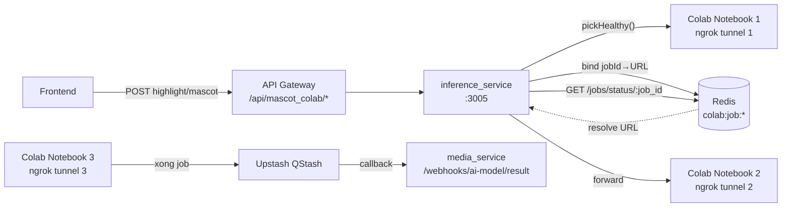
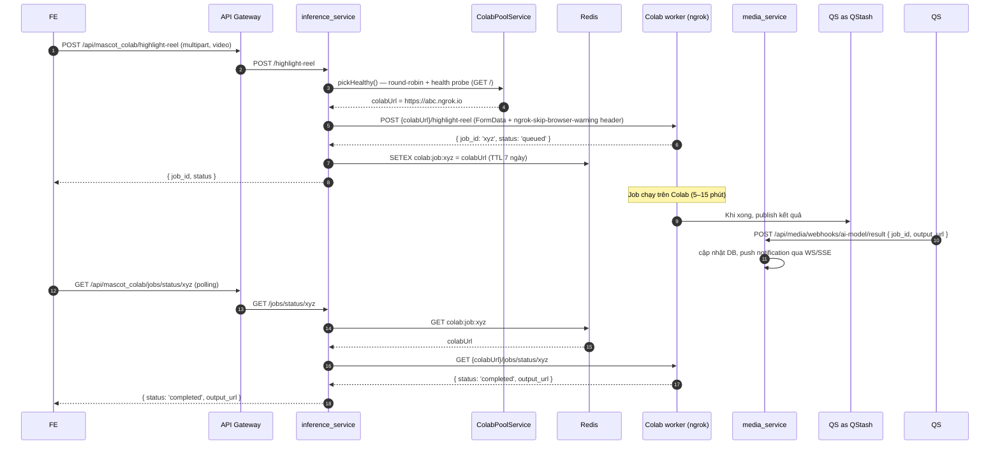

# Inference Service (Colab Pool)

> Entry: `backend_services/inference_service/src/main.ts` · NestJS · Port mặc định `3005`

Service orchestrator giữa hệ thống microservice và một **pool các Colab notebook** chạy FastAPI, expose qua ngrok. Mỗi notebook chạy mô hình ML nặng (highlight reel detection, mascot lip-sync, quiz generation). Service này:

- Quản lý danh sách worker URLs (`COLAB_API_URLS`).
- Round-robin pick worker + health-check (cache TTL ngắn).
- Forward request (multipart/form-data hoặc JSON) sang Colab.
- Lưu mapping `jobId → colabUrl` trong Redis (TTL 7 ngày) để các request status/download sau đó đi đúng worker.
- Trả lỗi `503 Service Unavailable` nếu không còn worker healthy.

Gateway forward `/api/mascot_colab/*` → `inference_service` (xem `api-gateway.md`).

---

## Architecture



---

## Module tree

```
src/
├── main.ts                     # bootstrap, CORS, port từ env PORT (fallback 3005)
├── app.module.ts               # ConfigModule (colab + redis) + HttpModule + RedisModule + ColabModule
├── app.controller.ts           # endpoints
├── app.service.ts              # forwardForm / forwardJson, pickAndPersist
├── config/
│   ├── colab.config.ts         # parse COLAB_API_URLS (multi) hoặc COLAB_API_URL (single)
│   └── redis.config.ts
├── colab/
│   ├── colab.module.ts
│   ├── colab-pool.service.ts   # round-robin + health probe + in-memory cache
│   └── job-registry.service.ts # Redis SETEX/GET colab:job:{jobId} → URL
└── redis/
    └── redis.module.ts         # provide REDIS_CLIENT (ioredis, @Global)
```

---

## Endpoints (mounted tại root, gateway thêm prefix `/api/mascot_colab`)

| Method | Path (gateway) | Body | Mô tả |
|---|---|---|---|
| GET | `/api/mascot_colab/` | — | Trang home liệt kê endpoints |
| GET | `/api/mascot_colab/pool/status` (`?force=1` để bỏ qua cache) | — | Trả `PoolStatus { total, healthy, workers[] }` |
| POST | `/api/mascot_colab/highlight-reel` | multipart `video=<file>` + body | Upload trực tiếp video → forward FormData sang Colab `/highlight-reel` |
| POST | `/api/mascot_colab/highlight-reel-link` | JSON `{ video_url }` | Phiên bản dùng URL (Bunny / Cloudinary) thay vì upload file |
| POST | `/api/mascot_colab/mascot` | multipart `audio=<file>` + body `{ mascot_image_url, origin_file_name }` | Tạo mascot video (lip-sync) — legacy endpoint |
| POST | `/api/mascot_colab/generate-quiz` | JSON (NoFilesInterceptor) | Forward `/generate-quiz` |
| GET | `/api/mascot_colab/jobs/status/:job_id` | — | Resolve URL từ Redis → GET status trên Colab |
| GET | `/api/mascot_colab/download/:job_id` | — | Resolve URL → stream file về client |

> Identity: forward header `x-user-id` cho Colab nếu có (`parseUserId(userIdHeader)`).

---

## Sequence: highlight reel (upload file)



---

## Pool semantics

`ColabPoolService.pickHealthy()`:

1. Lấy URL kế tiếp theo `cursor` round-robin.
2. Check `healthCache.get(url)`:
   - Nếu cache còn hiệu lực (`Date.now() - checkedAt < healthCacheTtlMs`, mặc định 5s) → dùng kết quả cache.
   - Hết hạn → `GET {url}{healthPath}` (timeout `healthTimeoutMs`, default 3s, **gắn header `ngrok-skip-browser-warning`** để Colab/ngrok không trả HTML cảnh báo).
3. Healthy → trả URL; unhealthy → thử URL kế tiếp (max = `urls.length`).
4. Nếu duyệt hết mà không healthy → `ServiceUnavailableException` (HTTP 503).

`JobRegistryService`:

- `bind(jobId, colabUrl)`: `SETEX colab:job:{jobId} TTL=7d colabUrl`.
- `resolve(jobId)`: GET key; nếu null → `NotFoundException`.
- `forget(jobId)`: best-effort DEL.

---

## Cross-service contract với Colab notebook

Notebook FastAPI phải expose tối thiểu:

| Endpoint | Mô tả |
|---|---|
| `GET /` (hoặc path config `COLAB_HEALTH_PATH`) | Health probe — trả 200 + JSON tuỳ ý |
| `POST /highlight-reel` | multipart `video`, trả `{ job_id, status: 'queued' }` |
| `POST /highlight-reel-link` | JSON `{ video_url }`, trả `{ job_id }` |
| `POST /mascot` | multipart `audio` + body, trả `{ job_id }` |
| `POST /generate-quiz` | JSON, trả `{ job_id }` |
| `GET /jobs/status/:job_id` | Trả `{ status, ... }` |
| `GET /download/:job_id` | Stream file output |

Khi xong job, notebook publish kết quả vào **Upstash QStash** → QStash callback `media_service /webhooks/ai-model/result`. Inference service không nhận callback trực tiếp.

---

## Environment variables

| Env | Mặc định | Mô tả |
|---|---|---|
| `PORT` | `3005` | Port service |
| `COLAB_API_URLS` | `''` | List URL ngrok comma-separated. **Khuyến nghị** |
| `COLAB_API_URL` | `''` | Single URL (legacy fallback) |
| `COLAB_HEALTH_TIMEOUT_MS` | `3000` | Timeout mỗi lần probe |
| `COLAB_HEALTH_CACHE_TTL_MS` | `5000` | Cache health probe |
| `COLAB_HEALTH_PATH` | `'/'` | Path probe |
| `COLAB_REQUEST_TIMEOUT_MS` | `600000` (10 phút) | Timeout forward request (upload + queue) |
| `REDIS_HOST` / `REDIS_PORT` / `REDIS_PASSWORD` / `REDIS_DB` | `localhost`/`6379`/—/`0` | |
| `REDIS_JOB_TTL_SECONDS` (đọc qua `redis.jobTtlSeconds`) | `604800` (7 ngày) | TTL mapping job → URL |

---

## Scripts

```bash
yarn start:dev
yarn build
yarn start:prod
```

---

## Tips

- **503 No healthy Colab worker** → ngrok tunnel chết, hoặc URL trong env không đúng, hoặc notebook không reply trong 3s. Force re-probe bằng `GET /pool/status?force=1`.
- **Job status trả 404** → Redis mất key (TTL 7 ngày, hoặc Redis bị restart không persist), hoặc job tạo trên worker này nhưng worker đã chết và URL bị remove khỏi pool.
- **Upload timeout** → tăng `COLAB_REQUEST_TIMEOUT_MS`; nhưng tốt hơn là upload file lên Bunny/Cloudinary trước rồi gọi `/highlight-reel-link`.
- **ngrok cảnh báo HTML** → header `ngrok-skip-browser-warning: true` đã được set sẵn cho mọi outbound; nếu sửa kèm proxy custom phải giữ header này.
- **Thêm worker mới** → append URL vào `COLAB_API_URLS`, restart service (không hot-reload).
- **AI result không vào media_service** → debug ở Colab/QStash, không phải service này. Inference service chỉ "fire-and-forget" sang Colab.
