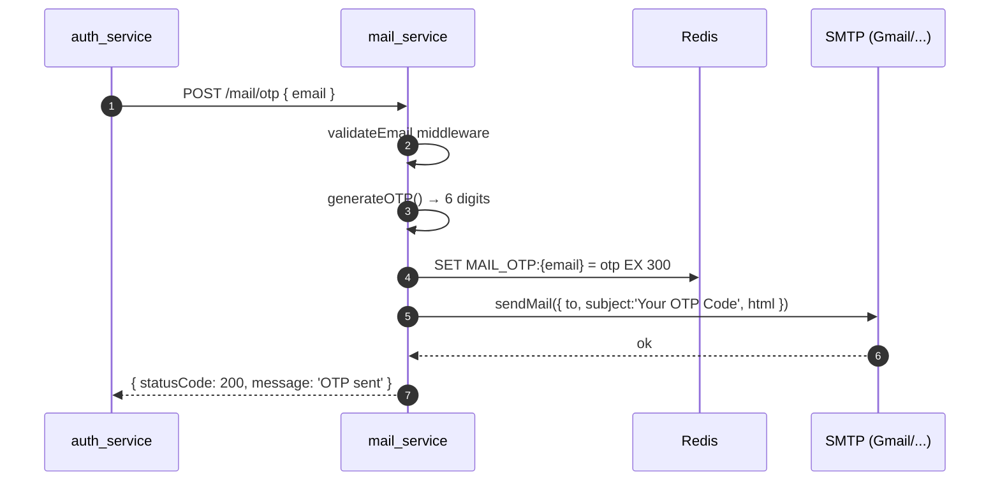

# Mail Service

> Entry: `backend_services/mail_service/src/server.js` · Express + plain JS · Port mặc định `3000`

Service nhỏ nhất: gửi email transactional qua **Nodemailer** (SMTP) và quản lý OTP trong Redis.

Chức năng:

- Sinh OTP 6 chữ số, lưu Redis key `MAIL_OTP:{email}` (TTL 300s = 5 phút).
- Gửi OTP qua email.
- Gửi link reset password.
- Gửi mail tự do (custom message).

`auth_service` gọi vào service này qua HTTP (xem `auth-service.md > forgot-password`). OTP key sau đó được `auth_service` đọc/xoá khi user submit `/auth/check-otp`.

---

## Sequence: gửi OTP



---

## Module tree

```
src/
├── server.js              # bootstrap (listen 0.0.0.0:PORT)
├── app.js                 # express.json + routes + errorMiddleware
├── routes/
│   ├── index.js
│   └── mail.route.js
├── controllers/
│   ├── index.js
│   └── mail.controller.js
├── services/
│   ├── index.js
│   └── mail.service.js    # transporter.sendMail wrapper
├── templates/
│   ├── index.js
│   └── mail.template.js   # otp / forgotPassword / custom HTML
├── middlewares/
│   └── validateEmail, errorMiddleware
├── configs/
│   ├── mail.config.js     # nodemailer.createTransport
│   └── redis.config.js    # ioredis client
└── utils/
    └── otp.util.js        # generateOTP(length=6)
```

---

## Endpoints (mount tại `/mail`)

| Method | Path | Middleware | Body | Mô tả |
|---|---|---|---|---|
| POST | `/mail/otp` | `validateEmail` | `{ email }` | Sinh OTP, lưu Redis (TTL 5 phút), gửi mail. **Trả 200 nếu thành công, không trả OTP về** |
| POST | `/mail/forgot-password` | `validateEmail` | `{ email, link }` | Gửi link reset (link do caller cung cấp) |
| POST | `/mail/custom` | `validateEmail` | `{ email, message }` | Gửi mail tự do |

> Service này **không** mount qua gateway — `auth_service` gọi trực tiếp vào `MAIL_SERVICE_URL` (server-to-server).

---

## OTP convention

- Key: `MAIL_OTP:{email lowercase trim}`
- Value: 6 chữ số (string)
- TTL: `300` (giây)
- Producer: `mail_service`
- Consumer: `auth_service > checkOtpAndResetPassword` (đọc + xoá khi reset xong)

```js
// utils/otp.util.js
exports.generateOTP = function (length = 6) {
  return Math.floor(
    Math.pow(10, length - 1) + Math.random() * Math.pow(10, length - 1)
  ).toString();
};
```

> Hàm này không phải cryptographic-secure (dùng `Math.random`). Đủ cho OTP đăng ký nhưng nếu cần audit chặt → đổi sang `crypto.randomInt`.

---

## Mail templates (`templates/mail.template.js`)

```js
exports.otp = (otp) => ({
  subject: 'Your OTP Code',
  html: `<h2>Your OTP: ${otp}</h2><p>Expires in 5 minutes</p>`,
});

exports.forgotPassword = (link) => ({
  subject: 'Reset Password',
  html: `<a href="${link}">Reset your password</a>`,
});

exports.custom = (message) => ({
  html: `<p>${message}</p>`, // không có subject
});
```

> Template hiện rất tối giản. Nếu cần email branded thì replace bằng MJML/Handlebars + render.

---

## Environment variables

| Env | Mô tả |
|---|---|
| `PORT` | Port (default `3000`) |
| `MAIL_HOST` | SMTP host (vd `smtp.gmail.com`) |
| `MAIL_PORT` | SMTP port (vd `587`) |
| `MAIL_USER` | Account SMTP |
| `MAIL_PASS` | App password (Gmail yêu cầu App Password, không phải password thường) |
| `MAIL_FROM` | Địa chỉ "From" hiển thị trong mail |
| `REDIS_HOST` | Redis host (default `127.0.0.1`) |
| `REDIS_PORT` | Default `6379` |
| `REDIS_PASSWORD` | Default empty |

Note: `mail.config.js` set `secure: false` — phù hợp Gmail port 587 (STARTTLS). Nếu dùng port 465 cần đổi `secure: true`.

---

## Scripts

```bash
yarn start        # node src/server.js
yarn dev          # nodemon src/server.js
```

---

## Tips

- **Gmail Auth error** → bật 2FA và tạo App Password. `MAIL_PASS` không phải password Google chính.
- **OTP không vào hộp thư** → check spam, check log Nodemailer, thử với `smtp.ethereal.email` để debug.
- **OTP key không tồn tại khi check** → TTL 5 phút đã hết, user submit chậm. Re-gửi OTP mới.
- **Đổi TTL** → sửa hardcode `'EX', 300` trong `mail.controller.js > sendOTP`. (Nên đưa lên env.)
- **Service crash khi Redis down** → `ioredis` retry tự động; mail vẫn gửi được nhưng Redis SET sẽ fail → OTP không lưu → check-otp fail. Theo dõi log `Redis error:`.
