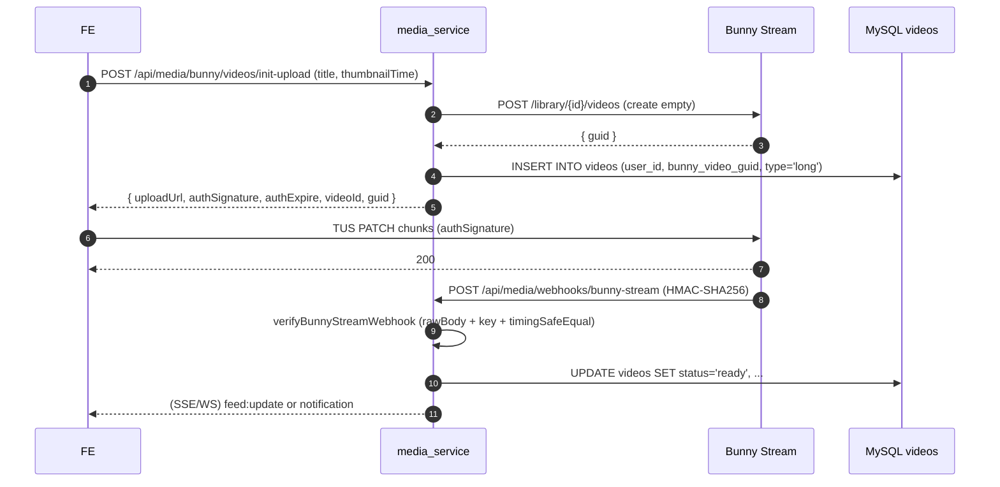
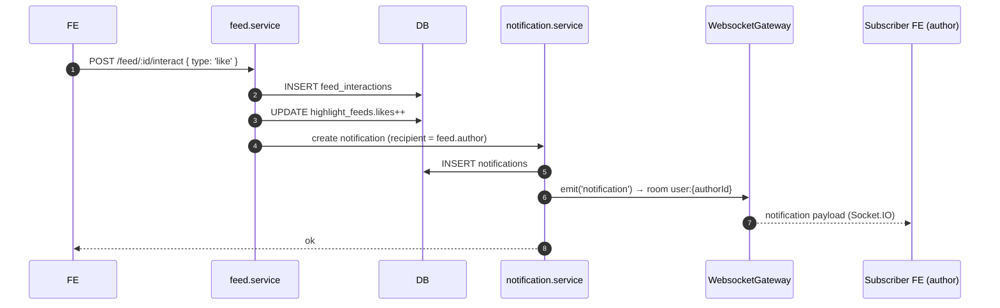

# Media Service

> Entry: `backend_services/media_service/src/main.ts` · NestJS · Port mặc định `8003`

Trung tâm media + realtime + social feed. Service lớn nhất, gom 12 feature module:

- **Videos** — CRUD + tích hợp Bunny Stream (TUS upload, webhook).
- **MascotImages** + **MascotOverlays** + **Projects** — editor mascot (overlay nhân vật lên video).
- **Cloudinary** — sign-upload preset + raw upload (SRT, ảnh).
- **Webhook** — Cloudinary, Bunny Stream, AI model (QStash callback).
- **Feed** (Highlight feed) — newsfeed dạng short-video, interactions (like/save/view), comments, recommendation worker.
- **Notifications** — DB-backed + push qua SSE/WebSocket.
- **SSE** — Server-Sent Events theo user.
- **WebSocket** — Socket.IO namespace `/media`, room `user:{id}`.

Identity từ header `X-User-Id` / `X-User-Role`. Một số endpoint (webhook, SSE) là public.

---

## Architecture overview

```mermaid
graph TD
    FE[Frontend]
    GW[API Gateway]
    MS[media_service]
    DB[(MySQL)]
    R[(Redis)]
    BUN[Bunny Stream]
    CLD[Cloudinary]
    INF[inference_service<br/>(Colab pool)]
    QS[Upstash QStash<br/>(AI callbacks)]

    FE -- HTTP /api/media/* --> GW
    FE -- Socket.IO /media --> GW
    GW --> MS
    MS --> DB
    MS --> R
    MS -- init TUS upload --> BUN
    BUN -- webhook /webhooks/bunny-stream --> MS
    FE -- raw upload (SRT, image) --> CLD
    CLD -- webhook /webhooks/cloudinary/upload --> MS
    INF -- result via QS --> QS
    QS -- /webhooks/ai-model/result --> MS
    MS -- SSE /sse/users/:userId/events --> FE
    MS -- Socket.IO emit --> FE
```

---

## Module tree

```
src/
├── main.ts                # rawBody:true (cần cho HMAC Bunny), CORS, ValidationPipe
├── app.module.ts          # imports tất cả module + ScheduleModule
├── config/                # database, jwt, redis
├── database/              # DatabaseModule
├── models/                # shared models (course, user, feed_*, notification)
├── dto/                   # CreateVideoDto, UpdateVideoDto
├── redis/                 # RedisService
├── videos/                # Video CRUD
├── images_mascot/         # MascotImage (Cloudinary backed)
├── projects/              # Project (timeline editor)
├── mascot_overlays/       # MascotOverlay (overlay items on project)
├── cloudinary/            # sign + upload endpoints
├── bunny/                 # TUS upload init + status/play-data
├── webhook/               # Cloudinary + Bunny + AI model callbacks
├── feed/                  # HighlightFeed + interactions + comments + worker
├── notifications/         # Notification model + service + push
├── sse/                   # Server-Sent Events
├── websocket/             # Socket.IO gateway, namespace /media
└── validators/
```

---

## Endpoints

### Videos (`@Controller('videos')`)

| Method | Path | Access (gateway) |
|---|---|---|
| POST | `/videos` | authenticated |
| GET | `/videos/user/:type` (type ∈ `highlight` \| `mascot` \| `long`) | authenticated |
| GET | `/videos/:id` | authenticated |
| PATCH | `/videos/:id` | authenticated |
| DELETE | `/videos/:id` | authenticated |

> `VideoType` enum: `HIGHLIGHT`, `MASCOT`, `LONG` (Bunny long-form).

### Bunny Stream (`@Controller('bunny')`)

| Method | Path | Access | Mô tả |
|---|---|---|---|
| POST | `/bunny/videos/init-upload` | authenticated | Tạo Bunny video, ký TUS signature, INSERT row `videos` (type=`LONG`). Trả `{ uploadUrl, authSignature, authExpire, videoId }` cho TUS client |
| GET | `/bunny/videos/:bunnyVideoId/status` | authenticated | Polling trạng thái transcode |
| GET | `/bunny/videos/:bunnyVideoId/play-data` | authenticated | HLS playlist URL + token |

### Cloudinary (`@Controller('cloudinary')`)

| Method | Path | Access | Mô tả |
|---|---|---|---|
| POST | `/cloudinary/sign` | authenticated | Ký signature cho frontend upload trực tiếp lên Cloudinary |
| POST | `/cloudinary/upload` | authenticated | Backend-side upload (cho file ngắn) |

### Webhooks (`@Controller('webhooks')`) — **public**

| Method | Path | Verify | Mô tả |
|---|---|---|---|
| POST | `/webhooks/cloudinary/upload` | (không HMAC — chỉ thêm IP allowlist nếu cần) | Cloudinary gửi sau upload; service ghi `srt_raw_url` / `image_url` vào DB |
| POST | `/webhooks/ai-model/result` | HMAC `upstash-signature` (hoặc `x-inference-signature`) sha256 timingSafeEqual over rawBody, secret `INFERENCE_WEBHOOK_SECRET` — thiếu/sai → 401; log `[ai-webhook] verified` khi pass | QStash callback từ `inference_service` sau khi Colab xong job (highlight/mascot) |
| POST | `/webhooks/bunny-stream` | HMAC `x-bunnystream-signature` (sha256 timingSafeEqual) | Bunny Stream callback transcode-done; cập nhật `videos.bunny_video_guid`, status |

### Mascot Images (`@Controller('mascot_images')`)

| Method | Path | Access |
|---|---|---|
| POST | `/mascot_images` | authenticated |
| GET | `/mascot_images/user` | authenticated |
| GET | `/mascot_images/:id` | public |
| PATCH | `/mascot_images/:id` | authenticated |
| DELETE | `/mascot_images/:id` | authenticated |

### Mascot Overlays (`@Controller('mascot_overlays')`)

| Method | Path | Access |
|---|---|---|
| POST | `/mascot_overlays` | authenticated |
| GET | `/mascot_overlays/edit/:edit_id` | authenticated |
| GET | `/mascot_overlays/:id` | authenticated |
| PATCH | `/mascot_overlays/:id` | authenticated |
| DELETE | `/mascot_overlays/:id` | authenticated |

### Projects (`@Controller('projects')`)

| Method | Path | Access |
|---|---|---|
| POST | `/projects` | authenticated |
| GET | `/projects/user` | authenticated |
| GET | `/projects/:id` | authenticated |
| PATCH | `/projects/:id` | authenticated |
| DELETE | `/projects/:id` | authenticated |

### Feed (`@Controller('feed')`) — highlight newsfeed

| Method | Path | Access | Mô tả |
|---|---|---|---|
| POST | `/feed` | authenticated (gateway: LECTURER/ADMIN write) | Add highlight vào feed |
| GET | `/feed` | authenticated | Query `cursor, limit, courseId, mode (recommended\|search), search, sessionId, hashtag` — `hashtag` filter dùng `JSON_CONTAINS(hashtags, JSON_QUOTE(:tag))`, chấp nhận cả `#tag` và `tag`, combine với `mode=recommended` được (bypass Redis cache để không bẩn ranked list). |
| GET | `/feed/viewed` | authenticated | Lịch sử đã xem |
| GET | `/feed/saved` | authenticated | Đã save |
| GET | `/feed/mine` | ADMIN, LECTURER | Highlight do user tạo |
| GET | `/feed/trending` | public | |
| GET | `/feed/hashtags/trending` | public | Query `days` (default 7, max 90), `limit` (default 20, max 100). Trả `{ items: [{ tag, count, growthPct }] }` — count là số feed ACTIVE chứa hashtag trong cửa sổ N ngày, `growthPct` so với N ngày trước (`null` nếu kỳ trước count=0 → tag mới). Aggregation chạy trên JS, không cần `JSON_TABLE`. |
| GET | `/feed/stats/creator` | ADMIN, LECTURER | |
| GET | `/feed/stats/trending` | ADMIN, LECTURER | |
| GET | `/feed/:id/stats` | ADMIN, LECTURER | |
| POST | `/feed/:id/interact` | authenticated | Body `{ type: 'like'\|'save'\|... }` (`FeedInteractionType`) |
| POST | `/feed/:id/view` | authenticated | Ghi nhận lượt xem |
| PUT | `/feed/:id` | (gateway: LECTURER/ADMIN) | Update meta |
| POST | `/feed/:id/comments` | authenticated | Tạo comment (gửi notification cho author) |
| GET | `/feed/:id/comments` | authenticated | List |
| GET | `/feed/:id/comment/detail` | authenticated | |
| PATCH | `/feed/:id/comments/:commentId` | authenticated | |
| DELETE | `/feed/:id/comments/:commentId` | authenticated | |

> Recommendation worker: `feed/feed-recommendation.worker.ts` chạy cron qua `ScheduleModule` để cập nhật cache trending.

### Notifications (`@Controller('notifications')`)

| Method | Path | Access | Mô tả |
|---|---|---|---|
| GET | `/notifications` | authenticated | Cursor pagination, filter `is_read` |
| PUT | `/notifications/bulk` | authenticated | Body `{ ids?: number[], all?: boolean, is_read: true }` |
| GET | `/notifications/:id` | authenticated | |
| PATCH | `/notifications/:id` | authenticated | |

### SSE (`@Controller('sse')`) — **public** (gateway không gắn auth)

| Method | Path | Mô tả |
|---|---|---|
| GET | `/sse/users/:userId/events` (`@Sse`) | Stream `EventSource` cho user (notification, feed events) |

### WebSocket — Socket.IO namespace `/media`

Cấu hình ở `websocket/websocket.gateway.ts`:

```ts
@WebSocketGateway({ namespace: '/media', cors: { origin: '*' } })
```

- Khi connect: client truyền `?userId=123` → join room `user:123`.
- Server emit `notification`, `feed:update`, ... vào room.
- Sự kiện FE gửi: `ping` → trả `pong`; `subscribe:user` → join room manually.

Gateway forward upgrade qua `/socket.io` → media (xem `api-gateway.md`).

---

## Sequence: upload long-form video (Bunny TUS)



---

## Sequence: feed interaction triggers notification



---

## Enums chính

```ts
// videos/video.model.ts
export enum VideoType { HIGHLIGHT='highlight', MASCOT='mascot', LONG='long' }

// models/highlight_feed.model.ts
export enum HighlightFeedStatus { ACTIVE='active', HIDDEN='hidden', REMOVED='removed' }

// models/feed_interactions.model.ts
export enum FeedInteractionType { LIKE='like', SAVE='save' /* ... */ }
```

---

## Cross-service flows

| Bên gọi | Endpoint | Khi nào |
|---|---|---|
| Bunny Stream | `POST /webhooks/bunny-stream` | Transcode hoàn tất |
| Cloudinary | `POST /webhooks/cloudinary/upload` | Upload SRT/ảnh xong (eager_async hoặc notification_url) |
| `inference_service` (qua Upstash QStash) | `POST /webhooks/ai-model/result` | Colab job xong (highlight reel / mascot video) |
| Frontend Socket.IO client | namespace `/media` | Realtime notifications |

---

## Environment variables

| Env | Mô tả |
|---|---|
| `PORT` (mặc định `8003`) | |
| `DB_*` | MySQL shared (host/port/user/pass/db) |
| `REDIS_HOST` / `REDIS_PORT` / `REDIS_PASSWORD` / `REDIS_DB` / `REDIS_TTL` (default 600s) | Cache feed/recommendation |
| `JWT_*` | (load nhưng gateway đã verify) |
| `BUNNY_STREAM_LIBRARY_ID` | Library id Bunny |
| `BUNNY_STREAM_API_KEY` | Read-write key (init upload, get status) |
| `BUNNY_STREAM_READ_ONLY_API_KEY` | Cho play-data signed URL |
| `BUNNY_STREAM_WEBHOOK_SECRET` | HMAC key verify webhook |
| `INFERENCE_WEBHOOK_SECRET` | HMAC-SHA256 secret verify webhook AI model (`POST /webhooks/ai-model/result`) |
| `CLOUD_NAME` / `API_KEY` / `API_SECRET` | Cloudinary credentials (đặt tên không có prefix) |
| `NODE_ENV` | `development` → bật Sequelize log |

---

## Scripts

```bash
yarn start:dev
yarn build
yarn start:prod
```

---

## Hashtag filter `GET /feed?hashtag=<tag>`

- Tag được normalize sang `lowercase + strip whitespace`. Filter query thử cả 2 biến thể (`tag` và `#tag`) để khớp dữ liệu cũ vì lịch sử FE từng store hashtag không đồng nhất.
- SQL clause được build bằng `Sequelize.literal('JSON_CONTAINS(HighlightFeed.hashtags, JSON_QUOTE(:tag))')`, escape tag qua `sequelize.escape()` (chống injection).
- Khi có hashtag, `subQuery: false` được set để literal cột `HighlightFeed.hashtags` không bị Sequelize wrap mất.
- Kết hợp với `mode=recommended`: filter được apply ở `computeRankedCandidates` (sửa `baseWhere`). Redis cache ranked list bị **bypass** khi có hashtag để không trộn kết quả lệch tag — chấp nhận overhead vì tần suất click tag thấp hơn scroll feed thường.

### Index hỗ trợ

Migration `database/knex_migrations/023_highlight_feed_hashtags_index.js` thêm **multi-valued index** trên cột `hashtags`:

```sql
ALTER TABLE highlight_feed
  ADD INDEX idx_highlight_feed_hashtags_mv ( (CAST(hashtags AS CHAR(64) ARRAY)) );
```

Yêu cầu MySQL >= 8.0.17. Với version cũ, doc trong migration mô tả fallback bằng generated column + index thường.

## Trending hashtags

`getTrendingHashtags(days, limit)` query 2 cửa sổ thời gian liền kề (current `[now-N, now]` + previous `[now-2N, now-N]`), aggregate tag-count trên Node.js (set-dedupe trong từng feed để không double-count). Trả `growthPct = (curr - prev) / prev * 100`, `null` khi `prev === 0`.

Endpoint **public** — đặt rule access policy `GET /api/media/feed/hashtags/trending` access: `public` TRƯỚC catch-all `/api/media/feed/**` authenticated trong `api_gateway/src/middleware/access-policy.ts`.

Test reference: `src/feed/feed.service.spec.ts` (12 case: 0/1/nhiều hashtag, normalize, dedupe, growth +/-/null, ordering, window math, combine `search`+`hashtag`).

---

## Tips

- **Bunny webhook 401** → `BUNNY_STREAM_WEBHOOK_SECRET` sai, hoặc body bị parse trước khi verify (cần `rawBody: true` ở `NestFactory.create`, đã set).
- **SSE chết sau N giây** → kiểm tra proxy timeout (nếu chạy sau ngrok/Cloudflare phải tăng). Gateway không buffer SSE — đi thẳng qua proxy.
- **Socket.IO không kết nối** → frontend phải dùng namespace `/media` (không phải default `/`). Phải truyền `userId` qua handshake query.
- **Webhook AI model không vào** → QStash retry rất nhiều lần; check log `webhook.service.handleAIResult`, header `upstash-signature`.
- **Feed query chậm** → recommendation worker cập nhật cache; nếu Redis chết, query DB sẽ chậm. Check `feed-recommendation.worker.ts`.
- **Cloudinary upload không có URL trong DB** → webhook chưa được Cloudinary gọi (yêu cầu HTTPS public URL, set `notification_url` khi upload).
