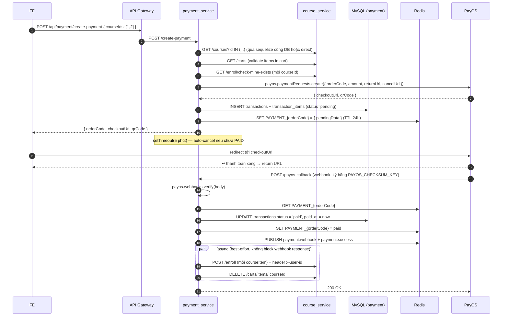

# Payment Service

> Entry: `backend_services/payment_service/src/server.js` · Express + plain JS · Port mặc định `8006` (env `PORT`, fallback `3000`)

Tích hợp **PayOS** (cổng thanh toán VN). Service không xài Nest, không TypeScript.

Chức năng:

- Tạo payment link từ giỏ hàng (`create-payment`) hoặc mua ngay (`buy-now`).
- Nhận webhook PayOS (`payos-callback`), verify signature, cập nhật `transactions`, tự động enroll user và dọn cart.
- Publish event qua Redis Pub/Sub (`payment:webhook`, `payment:success`, `payment:failed`) cho service khác subscribe.
- Trang return/cancel HTML đơn giản cho redirect từ PayOS.

---

## Sequence: thanh toán end-to-end



---

## Module tree

```
src/
├── server.js              # bootstrap, db.sequelize.authenticate()
├── app.js                 # express + routes + errorMiddleware
├── routes/
│   ├── index.js
│   └── payment.route.js   # mọi endpoint
├── controllers/
│   ├── index.js
│   └── payment.controller.js
├── services/
│   ├── index.js
│   ├── payment.service.js # business logic + PayOS SDK
│   └── event.publisher.js # Redis Pub/Sub publisher
├── models/
│   ├── index.js
│   ├── transaction.model.js
│   ├── transaction_item.model.js
│   └── course.model.js    # read-only reference đến bảng courses
├── middlewares/
├── configs/
├── views/                 # payment_success.html, payment_cancel.html
└── utils/
```

---

## Endpoints (mount tại `/` — gateway thêm prefix `/api/payment`)

| Method | Path (gateway) | Access | Body / Param | Mô tả |
|---|---|---|---|---|
| POST | `/api/payment/create-payment` | authenticated | `{ courseIds: number[], userId? }` | Tạo PayOS payment link từ cart. Validate course tồn tại, `status=publish`, có trong cart, user chưa enroll |
| POST | `/api/payment/buy-now` | authenticated | `{ courseId, userId? }` | Mua thẳng 1 course, không qua cart |
| POST | `/api/payment/payos-callback` | **public** | PayOS webhook payload | Verify signature, update transaction, publish Redis event, enroll + clean cart |
| GET | `/api/payment/order-status/:orderCode` | public | — | Trả status từ Redis hoặc DB |
| GET | `/api/payment/transactions` | authenticated | query `user_id` | List transactions của user |
| GET | `/api/payment/transactions/:id` | authenticated | — | Detail (kèm `transaction_items`) |
| GET | `/api/payment/return` | public | (PayOS redirect) | Trả static HTML `payment_success.html` |
| GET | `/api/payment/cancel` | public | (PayOS redirect) | Trả static HTML `payment_cancel.html` |

---

## Validation flow trước khi tạo PayOS link

`payment.service.js > createPaymentLink`:

1. `courseIds` phải là array, length > 0.
2. `SELECT * FROM courses WHERE id IN (courseIds)` — báo 404 nếu thiếu id.
3. Mỗi course phải có `status = 'publish'` — báo 400.
4. Health-check `GET {COURSE_SERVICE_URL}/` — báo 503 nếu down.
5. `validateCoursesInCart(userId, courseIds)` — gọi `GET {COURSE_SERVICE_URL}/carts` với header `x-user-id`. Course nào không có trong cart → 400.
6. Loop `GET /enroll/check-mine-exists?userId&courseId` — nếu đã enroll → 409.
7. `totalAmount = sum(course.price)`, `orderCode = Date.now()`.
8. Gọi `payos.paymentRequests.create({ orderCode, amount, description, returnUrl, cancelUrl })`. Nếu PayOS lỗi → vẫn lưu transaction với checkoutUrl = null (fail-soft).
9. `BEGIN TX`: INSERT transactions + transaction_items + SET Redis `PAYMENT_{orderCode}` → COMMIT.
10. `setTimeout(5 phút)`: nếu PayOS báo chưa PAID → `payos.paymentRequests.cancel`, mark transaction `failed`.

---

## Webhook signature & idempotency

```js
// payment.service.js > payosCallback
const webhookData = await payos.webhooks.verify(req.body);
// → ném 403 'Chữ ký không hợp lệ' nếu sai PAYOS_CHECKSUM_KEY
```

`webhookData.code === '00'` → success. `transactions.status` chuyển sang `paid` hoặc `failed`. **Không có idempotency key** — nếu PayOS retry, code sẽ update lại trạng thái và publish event lại. Enroll thì idempotent ở `course_service` (đã check tồn tại).

---

## Redis Pub/Sub events

Xem `backend_services/payment_service/REDIS_EVENTS.md`.

| Channel | Payload | Khi publish |
|---|---|---|
| `payment:webhook` | `{ type:'PAYMENT_WEBHOOK', timestamp, data:webhookData }` | Mỗi webhook hợp lệ |
| `payment:success` | `{ type:'PAYMENT_SUCCESS', orderCode, data:{ user_id, transaction_id, courseItems } }` | Khi `code === '00'` |
| `payment:failed` | `{ type:'PAYMENT_FAILED', orderCode, reason }` | Khi `code !== '00'` |

Ngoài ra key cache: `PAYMENT_{orderCode}` (TTL 24h) lưu pendingData.

> Hiện tại trong codebase **không có service nào subscribe** các channel này. Đây là extension point cho tương lai (ví dụ analytics, mail nhận hoá đơn).

---

## Bảng

```
transactions
  id PK auto
  user_id INT NOT NULL
  total_amount DOUBLE NOT NULL
  status ENUM('pending','paid','failed') DEFAULT 'pending'
  provider VARCHAR(50) DEFAULT 'payos'
  provider_order_id VARCHAR(255) UNIQUE NULLABLE   # = orderCode dưới dạng string
  created_at DATETIME
  paid_at DATETIME NULLABLE

transaction_items
  id PK auto
  transaction_id INT NOT NULL  # FK transactions.id
  course_id INT NOT NULL
  price DOUBLE NOT NULL        # snapshot tại thời điểm mua
```

Schema do migration `004_transaction_tables.js` (knex) tạo.

---

## Environment variables

| Env | Mô tả |
|---|---|
| `PORT` | Port (env file đặt `8006` cho consistency với gateway, mặc định code là `3000`) |
| `DB_HOST` / `DB_PORT` / `DB_USER` / `DB_PASSWORD` / `DB_NAME` (hoặc `DB_USERNAME` / `DB_DATABASE`) | MySQL (chia sẻ DB với các service Nest) |
| `REDIS_HOST` / `REDIS_PORT` / `REDIS_PASSWORD` | Pub/Sub + cache PAYMENT_* |
| `PAYOS_CLIENT_ID` | |
| `PAYOS_API_KEY` | |
| `PAYOS_CHECKSUM_KEY` | Verify webhook |
| `PAYOS_RETURN_URL` | Mặc định `http://localhost:{PORT}/payment/return` |
| `PAYOS_CANCEL_URL` | Mặc định `http://localhost:{PORT}/payment/cancel` |
| `PAYOS_WEBHOOK_URL` | Để service đăng ký webhook tự động khi startup (`payos.webhooks.confirm`) |
| `COURSE_SERVICE_URL` | Mặc định `http://localhost:8008` — gọi vào course_service trực tiếp (không qua gateway) |

---

## Scripts

```bash
node src/server.js
# hoặc nodemon src/server.js
```

(`package.json` đơn giản, không có script `dev`.)

---

## Tips

- **403 Chữ ký không hợp lệ** → `PAYOS_CHECKSUM_KEY` sai hoặc PayOS đang gửi sandbox key khác production.
- **Webhook không được PayOS gọi** → cần URL public HTTPS (ngrok khi dev). Set `PAYOS_WEBHOOK_URL` để service tự `webhooks.confirm` khi start.
- **User không được enroll sau khi thanh toán** → enroll chạy `Promise.allSettled` không block webhook, lỗi sẽ chỉ log. Check log `❌ Lỗi enroll khóa học` và call `POST /course/enroll` thủ công.
- **Transaction pending mãi mãi** → setTimeout 5 phút chỉ cancel khi service còn chạy. Nếu restart giữa chừng thì transaction sẽ pending vĩnh viễn — cần job cron riêng (chưa có).
- **Đổi cổng thanh toán** → rewrite `payment.service.js` (PayOS SDK couplied chặt) hoặc giữ adapter, swap event publisher chung.
