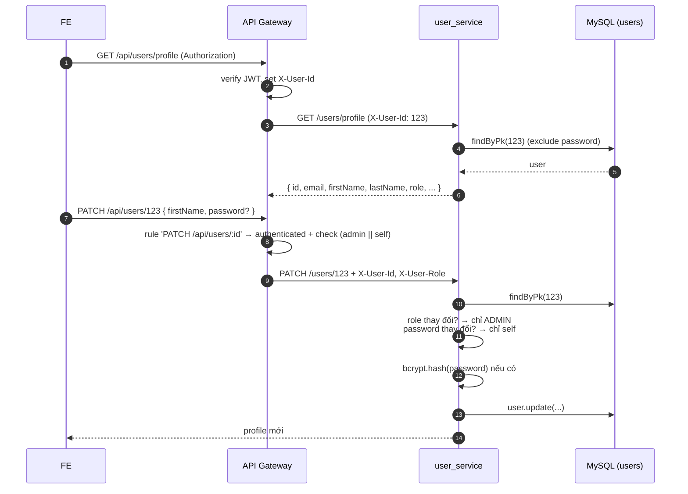

# User Service

> Entry: `backend_services/user_service/src/main.ts` · NestJS · Port mặc định `8002`

Quản lý thông tin user **sau khi đã được gateway authenticate**. Service này không cấp token, không gọi JWT — gateway đã forward identity qua header `X-User-Id` / `X-User-Role`.

Chức năng:

- Lấy profile của chính mình (`/users/profile`).
- Lấy profile theo id (`/users/:id`).
- List toàn bộ user (ADMIN).
- Update profile (chính chủ hoặc ADMIN).
- Reset password về default (chỉ ADMIN).

---

## Sequence: lấy profile và update



---

## Module tree

```
src/
├── main.ts                    # CORS origin:true, ValidationPipe
├── app.module.ts              # ConfigModule + DatabaseModule + UsersModule
├── users/
│   ├── user.model.ts          # Sequelize model `users` (cùng table với auth_service)
│   ├── users.controller.ts    # routes /users/*
│   ├── users.service.ts       # business logic + bcrypt
│   ├── users.module.ts
│   ├── dto/update-user.dto.ts
│   ├── decorators/
│   └── guards/                # JwtAuthGuard (chưa dùng — gateway đã auth)
├── database/                  # DatabaseModule
└── config/                    # database.config, jwt.config
```

---

## Endpoints (`@Controller('users')`)

| Method | Path | Access (gateway) | Headers | Logic |
|---|---|---|---|---|
| GET | `/users/profile` | authenticated | `x-user-id` | Trả profile của user gọi |
| GET | `/users/:id` | authenticated | — | Lấy profile theo id (exclude password) |
| GET | `/users` | ADMIN | — | List all users (order by id ASC) |
| PATCH | `/users/:id` | authenticated (+ self-or-admin check ở gateway) | `x-user-id`, `x-user-role` | Update profile. **Chỉ ADMIN đổi `role`**. **Chỉ self đổi `password`** (bcrypt). |
| PATCH | `/users/reset/:id` | ADMIN | `x-user-id`, `x-user-role` | Reset password về `'fivetoneu2026'` (constant `DEFAULT_RESET_PASSWORD`) |

> Tất cả service tin tưởng header từ gateway (zero-trust nội bộ không bật ở dự án này). Nếu chạy service standalone, hãy nhớ là `X-User-Id` / `X-User-Role` là điều kiện tiên quyết.

---

## Authorization rules (recap)

| Thao tác | Ai được phép |
|---|---|
| Xem `/users/profile`, `/users/:id` | Bất kỳ ai đã login |
| List `/users` | ADMIN |
| PATCH `/users/:id` | ADMIN hoặc chính user đó (gateway kiểm tra `userId === :id`) |
| PATCH `/users/:id` đổi `role` | ADMIN only (`users.service.ts` enforce) |
| PATCH `/users/:id` đổi `password` | Chính user đó (`users.service.ts` enforce) |
| PATCH `/users/reset/:id` | ADMIN |

---

## Bảng `users` (model `User`)

```
id              INT PK auto
email           VARCHAR(100) UNIQUE NOT NULL
password        VARCHAR(255) NULLABLE       # null nếu chỉ login Google
firstName       VARCHAR(100)
lastName        VARCHAR(100)
role            INT                         # 1 ADMIN | 2 STUDENT | 3 LECTURER
googleId        VARCHAR(255) UNIQUE NULLABLE
emailVerified   BOOLEAN DEFAULT false
is_banned       BOOLEAN DEFAULT false       # field 'is_banned' (snake_case)
avatarUrl       VARCHAR(500)
createdAt, updatedAt
```

> `is_banned` được thêm trong migration `020_reports_and_ban_columns.js`. `user_service` không có endpoint ban — `course_service` (reports module) là nơi cập nhật cờ này.

---

## UserRole enum

```ts
// src/users/users.service.ts
export enum UserRole {
  ADMIN = 1,
  STUDENT = 2,
  LECTURER = 3,
}
```

Khớp 1-1 với enum cùng tên ở `api_gateway/src/middleware/access-policy.ts`.

---

## Environment variables

| Env | Mặc định | Mô tả |
|---|---|---|
| `PORT` | `8002` | Port service |
| `DB_HOST` | `localhost` | |
| `DB_PORT` | `3306` | |
| `DB_USERNAME` | `graduation_user` | |
| `DB_PASSWORD` | `graduation_password` | |
| `DB_DATABASE` | `graduation_db` | |
| `JWT_SECRET` | (load nhưng chưa dùng để verify trong code hiện tại) | |

---

## Scripts

```bash
yarn start:dev
yarn build
yarn start:prod
yarn test
```

---

## Tips

- **Update không hiệu lực** → kiểm tra `forbidNonWhitelisted` của `ValidationPipe`: field không có trong `UpdateUserDto` sẽ bị reject.
- **400 Requester context not found** → service không nhận được `x-user-id` / `x-user-role`. Gateway không forward (gọi tay vào port 8002 mà quên set header).
- **Reset password trả về default** → password reset cứng là `'fivetoneu2026'`. Đổi trong `users.service.ts > DEFAULT_RESET_PASSWORD`.
