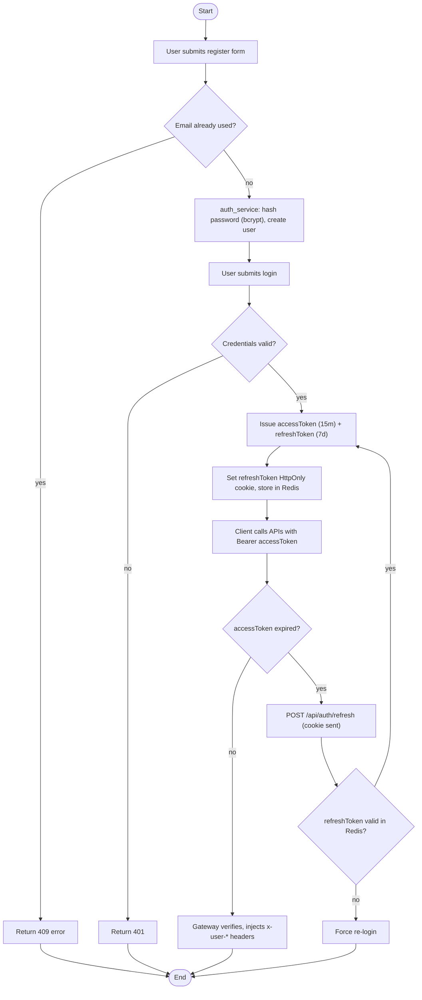
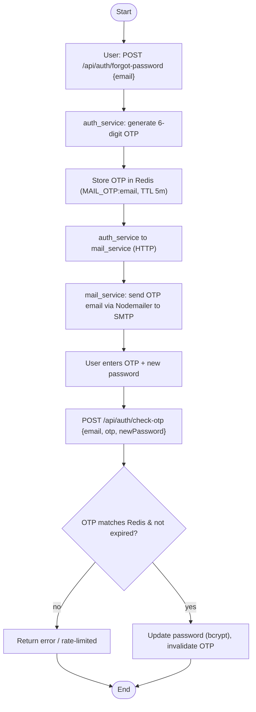
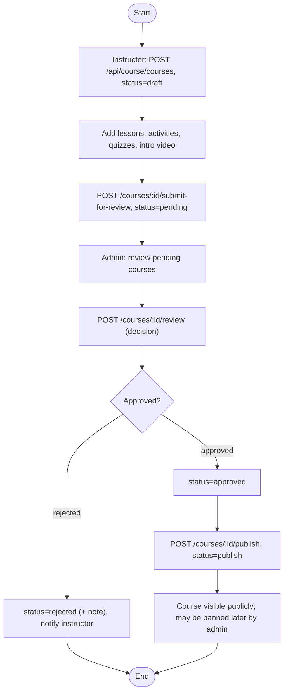
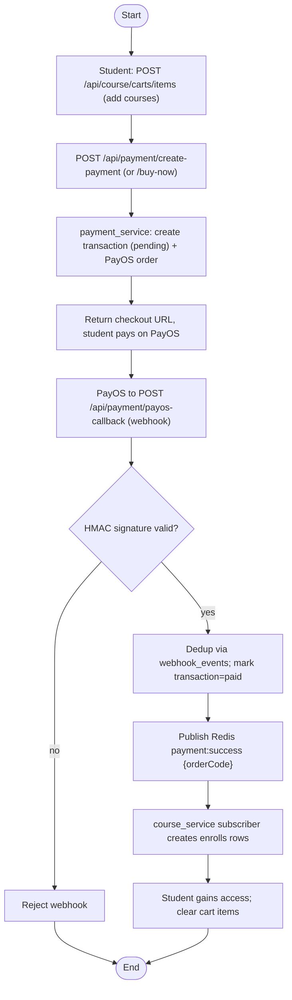
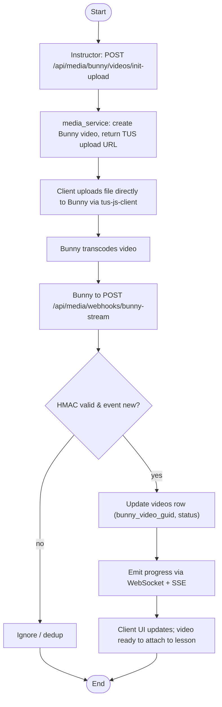
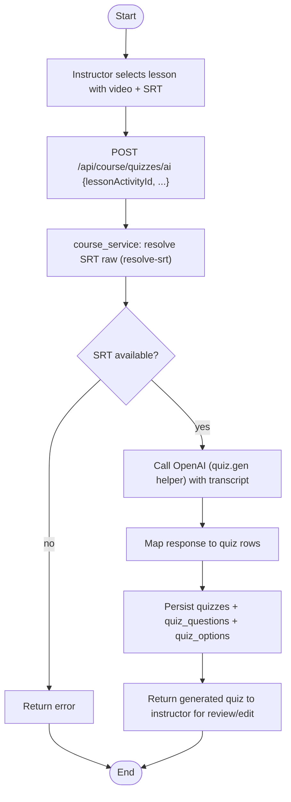
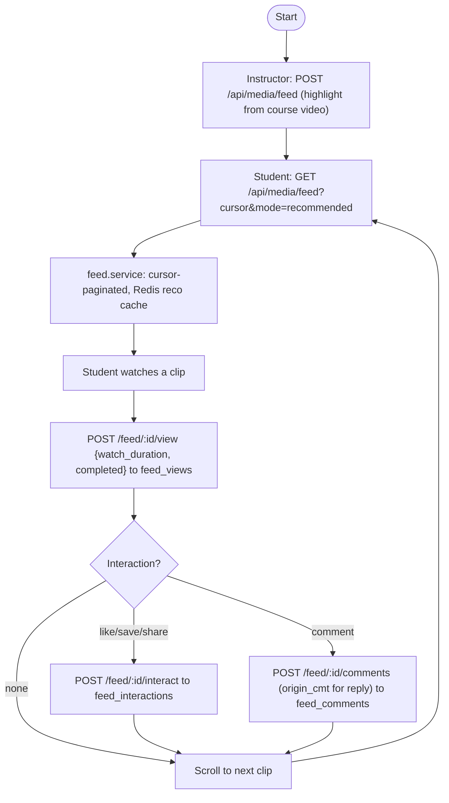
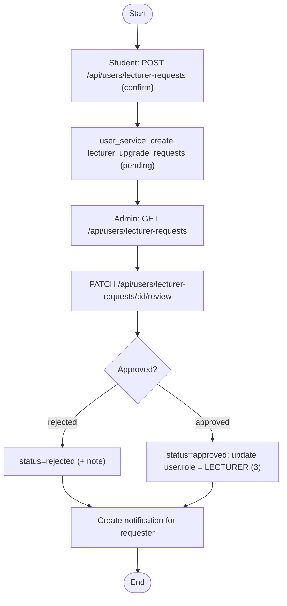

# Activity Diagrams — Process View

> UML 4+1 Process View. Eight key runtime flows, verified against service controllers.
> Each flow uses swimlane subgraphs (actor / service / external). Generated 2026-06-02.

---

## 1. Authentication (register → login → JWT → refresh)

---

## 2. Forgot-password OTP

---

## 3. Course lifecycle (create → submit → review → publish)

---

## 4. Enrollment + Payment (cart → PayOS → webhook → enroll)

---

## 5. Video upload (TUS → Bunny → webhook → SSE/WS)

---

## 6. AI quiz generation (SRT → OpenAI → persist)

---

## 7. Newsfeed (scroll → view → interact)

---

## 8. Lecturer upgrade request → admin review

## Notes

- Flows 4 and 5 both rely on `webhook_events` for idempotency (provider + event_id unique).
- Flow 4 enrollment grant is asynchronous via Redis Pub/Sub (`payment:success`).
- Flows 1, 2, 8 cross service boundaries: auth to mail (HTTP), user to media (notification).
- Activity decisions (diamonds) reflect real guard conditions in the controllers/services.
