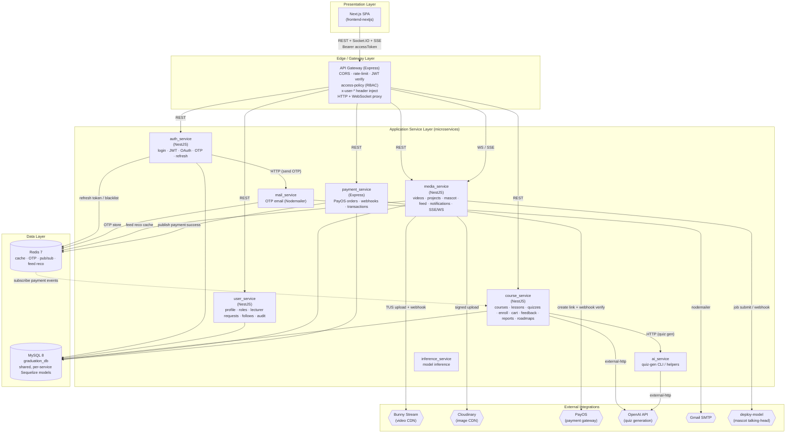

# Architecture — Logical View

> UML 4+1 Logical View. Layered decomposition of the platform into packages.
> Verified against `backend_services/*` and `docs/02-architecture.md`. Generated 2026-06-02.

## Layer responsibilities

| Layer | Package | Responsibility |
|---|---|---|
| Presentation | `frontend-nextjs` | SPA; sends Bearer access token; refresh token in HttpOnly cookie |
| Edge | `api_gateway` (Express) | CORS, rate-limit, JWT verify, RBAC via `access-policy.ts`, header injection, HTTP + WS proxy |
| Service | `auth_service` | register/login, JWT issue/refresh, Google OAuth, forgot-password OTP |
| Service | `user_service` | profile, role management, lecturer-upgrade requests, instructor follows, audit logs |
| Service | `course_service` | courses, lessons, lesson activities, quizzes (+AI), submissions, enroll, lesson progress, cart, wishlist, feedback, discussions, roadmaps, reports |
| Service | `media_service` | videos, edit projects, mascot images/overlays, highlight feed, comments/interactions/views, notifications, SSE/WebSocket |
| Service | `payment_service` (Express) | PayOS payment links, webhook verification, transactions, Redis events |
| Service | `mail_service` | OTP email via Nodemailer |
| Service | `ai_service` / `inference_service` | quiz generation helpers / model inference |
| Data | MySQL 8 `graduation_db` | single shared DB; each service registers only its models |
| Data | Redis 7 | refresh-token cache, OTP store, payment pub/sub, feed recommendation cache |
| External | Bunny / Cloudinary / PayOS / OpenAI / Gmail / deploy-model | third-party integrations |

## Notes

- No shared library: each Sequelize service re-declares the models it reads (e.g. `course.model.ts`
  exists in both `course_service` and `media_service`).
- Inter-service communication: synchronous HTTP (Axios) where needed (auth→mail), and
  asynchronous via Redis Pub/Sub (`payment:webhook`, `payment:success`, `payment:failed`).
- Socket.IO traffic is proxied straight through the gateway to `media_service`.
