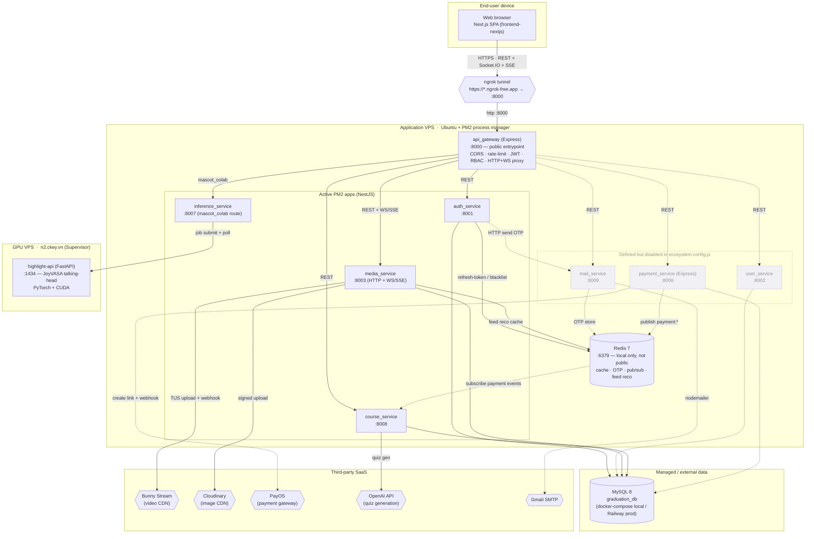

# Architecture — Deployment View

> UML 4+1 Physical/Deployment View. Maps runtime processes to hosts/infrastructure.
> Verified against `ecosystem.config.js`, `deploy_ngrok.sh`, `deploy_be.sh`,
> `backend_services/api_gateway/.env`, `docker-compose.yml`, `deploy-model/readme.md`.
> Generated 2026-06-07.

## Current topology (single app VPS + ngrok)

This reflects the most recent deploy scripts: every Node process runs under **PM2** on
one application VPS, the **API Gateway** (`:8000`) is the only inbound process and is
exposed to the public internet through an **ngrok** tunnel. Redis runs locally on the
same host; MySQL is external; the mascot talking-head model runs on a separate GPU VPS.

**Legend**

- Solid arrows / boxes = active in the current `ecosystem.config.js`.
- Dashed arrows / boxes = service is defined (ports in `deploy_be.sh`) but **commented out**
  in `ecosystem.config.js`, so it is not started by `deploy_ngrok.sh` in the current setup.
- `{{…}}` = external SaaS or tunnel; `[(…)]` = data store.

## Host / process inventory

| Host | Process | Port | Manager | Notes |
|---|---|---|---|---|
| App VPS | `api_gateway` (Express) | 8000 | PM2 | Only public-facing process; exposed via ngrok |
| App VPS | `auth_service` (NestJS) | 8001 | PM2 | active |
| App VPS | `user_service` (NestJS) | 8002 | PM2 | commented out in ecosystem |
| App VPS | `media_service` (NestJS) | 8003 | PM2 | active; HTTP + WebSocket/SSE |
| App VPS | `payment_service` (Express) | 8006 | PM2 | commented out in ecosystem |
| App VPS | `inference_service` (NestJS) | 8007 | PM2 | active; gateway `mascot_colab` route |
| App VPS | `course_service` (NestJS) | 8008 | PM2 | active |
| App VPS | `mail_service` (Express) | 8009 | PM2 | commented out in ecosystem |
| App VPS | Redis 7 | 6379 | redis-server / docker | local only, not exposed publicly |
| GPU VPS (`n2.ckey.vn`) | `highlight-api` (FastAPI/JoyVASA) | 1434 | Supervisor | PyTorch + CUDA talking-head generation |
| External | MySQL 8 `graduation_db` | 3306 | docker-compose (local) / Railway (prod) | all Sequelize services connect directly |
| SaaS | Bunny Stream / Cloudinary / PayOS / OpenAI / Gmail SMTP | — | — | third-party integrations |

## Notes

- **Gateway port**: `api_gateway/.env` sets `PORT=8000`; `deploy_ngrok.sh` forwards the ngrok
  tunnel to `:8000`. The gateway routes to `localhost:8001/8002/8003/8007` (auth/user/media/mascot).
- **`mascot_colab` route → `inference_service`**: the gateway's `MASCOT_COLAB_SERVICE_URL`
  points at `:8007` (inference), which in turn submits jobs to the JoyVASA FastAPI on the GPU VPS.
- **Redis is host-local** on the app VPS (`6379` not opened publicly) and serves cache,
  OTP storage, payment pub/sub, and feed-recommendation cache.
- **Inter-service comms**: synchronous HTTP (Axios, e.g. auth→mail) and asynchronous Redis
  Pub/Sub (`payment:webhook`, `payment:success`, `payment:failed`).

## Legacy alternative (Render) — for reference only

`render.yaml` (Mar 2026) describes an earlier topology where the gateway and several services
ran as Render web services with a Render-managed Redis. It is **stale**: it still declares the
deleted `edit-session-service` / `mascot-video-service` and omits `course_service` /
`media_service`. The current deployment is the single-VPS + ngrok setup above; treat `render.yaml`
as historical until it is reconciled.
