# Entity Relationship Diagram (ERD)

> Source of truth: `database/knex_migrations/001..041`. Reflects the final schema after
> all migrations are applied (36 tables). Generated 2026-06-02.

```mermaid
erDiagram
    roles {
        int id PK
        varchar name UK
        datetime createdAt
        datetime updatedAt
    }

    users {
        int id PK
        varchar email UK
        varchar password
        varchar firstName
        varchar lastName
        int role FK
        varchar googleId UK
        boolean emailVerified
        varchar avatarUrl
        boolean is_banned
        datetime createdAt
        datetime updatedAt
    }

    mascot_images {
        int image_id PK
        int user_id FK
        varchar url
        varchar job_id UK
        varchar thumbnail
        varchar public_id
        varchar format
        varchar name
        enum type "thumbnail_video|thumbnail_course|avt"
        datetime createdAt
        datetime updatedAt
    }

    mascot_overlays {
        int mascot_overlay_id PK
        int edit_id FK
        int image_id FK
        float position_x
        float position_y
        float scale
        float start_time
        float end_time
        int layer_index
        datetime created_at
        datetime updated_at
    }

    videos {
        int id PK
        int user_id FK
        int mascot_image_id FK
        enum type "highlight|mascot|long"
        varchar name
        text url
        double duration
        varchar thumbnail
        text srt_raw_url
        varchar bunny_video_guid UK
        varchar job_id UK
        datetime created_at
        datetime updated_at
    }

    projects {
        int edit_id PK
        int user_id FK
        int video_id FK
        varchar session_name
        enum status "draft|saved|finalized"
        datetime created_at
        datetime updated_at
    }

    courses {
        int id PK
        varchar name
        text description
        json categories
        enum level "Beginner|Intermediate|Advanced"
        time duration
        varchar language
        double price
        int user_id FK
        int video_id FK
        text thumbnail_url
        enum status "draft|pending|approved|rejected|publish|banned"
        datetime created_at
        datetime updated_at
    }

    lessons {
        int id PK
        int course_id FK
        varchar title
        enum contentType "video|text|quiz"
        json content
        time duration
        enum status "active|removed|blocked"
        varchar description
        int video_id FK
        datetime created_at
        datetime updated_at
    }

    lesson_activities {
        int id PK
        int lesson_id FK
        enum activity_type "quiz|assignment"
        text title
        text description
        int order_index
        int max_attempts
        enum status "draft|public|archived|removed"
        int created_by FK
        datetime created_at
        datetime updated_at
    }

    quizzes {
        int id PK
        int lesson_activity_id FK
        varchar name
        boolean shuffle_question
        boolean shuffle_option
        double passing_score
        int time_limit_minutes
        boolean is_in_video
        datetime created_at
        datetime updated_at
    }

    quiz_questions {
        int id PK
        int quiz_id FK
        enum ques_type "short_text|mcq|true_false"
        text ques_text
        decimal point
        text correct_ans
        int order_index
        time video_timestamp
        datetime created_at
        datetime updated_at
    }

    quiz_options {
        int id PK
        int question_id FK
        text option_text
        boolean is_correct
        int order_index
        datetime created_at
        datetime updated_at
    }

    quiz_submissions {
        int id PK
        int quiz_id FK
        int user_id FK
        decimal score
        decimal max_score
        decimal percent
        boolean passed
        int time_spent_seconds
        json answers
        datetime created_at
        datetime updated_at
    }

    enrolls {
        int id PK
        int user_id FK
        int course_id FK
        double progress
        enum status "active|completed|dropped"
        datetime enrolled_at
        datetime completed_at
    }

    lesson_progress {
        int id PK
        int user_id FK
        int course_id FK
        int lesson_id FK
        enum progress "not_started|in_progress|completed|video_completed"
        int last_video_position_ms
        datetime last_watched_at
    }

    feedbacks {
        int id PK
        int course_id FK
        int user_id FK
        tinyint rating
        text review_text
        boolean is_visible
        datetime created_at
        datetime updated_at
        datetime deleted_at
    }

    feedback_reactions {
        int id PK
        int feedback_id FK
        int user_id FK
        enum reaction_type "help_ful|dislike"
        datetime created_at
    }

    highlight_feed {
        int id PK
        int video_id FK
        int course_id FK
        varchar title
        text caption
        json hashtags
        enum status "active|hidden|removed"
        datetime created_at
        datetime updated_at
    }

    feed_interactions {
        int id PK
        int user_id FK
        int highlight_id FK
        enum type "like|save|share"
        datetime created_at
    }

    feed_views {
        int id PK
        int user_id FK
        int highlight_id FK
        float watch_duration
        boolean completed
        datetime viewed_at
    }

    feed_comments {
        int id PK
        int highlight_id FK
        int user_id FK
        text content
        int origin_cmt FK
        datetime created_at
        datetime updated_at
    }

    carts {
        int id PK
        int user_id FK
        int total_quantity
        double total_amount
        datetime created_at
        datetime updated_at
    }

    cart_items {
        int id PK
        int cart_id FK
        int course_id FK
        boolean saved_for_later
        datetime created_at
        datetime updated_at
    }

    transactions {
        int id PK
        int user_id FK
        double total_amount
        enum status "pending|paid|failed"
        varchar provider
        varchar provider_order_id UK
        datetime created_at
        datetime paid_at
    }

    transaction_items {
        int id PK
        int transaction_id FK
        int course_id FK
        double price
    }

    roadmaps {
        int id PK
        int user_id FK
        varchar description
        varchar name
        int total_courses
        int progress
    }

    roadmap_course {
        int id PK
        int course_id FK
        int roadmap_id FK
        int index_no
        enum status "null|learning|finish"
    }

    reports {
        int id PK
        enum target_type "teacher|course|lesson"
        int target_id
        text reason
        enum status "pending|approved|rejected"
        int reporter_id FK
        int approver_id FK
        text review_note
        datetime reviewed_at
        datetime created_at
        datetime updated_at
        datetime deleted_at
    }

    notifications {
        int id PK
        int user_id FK
        enum event_type "feed_video_image_lecturer_discussion_follow_course"
        varchar title
        text message
        json payload
        boolean is_read
        enum source_type "feed_comment|video|video_job|image|lecturer_request|discussion_post|instructor_follow|course"
        int source_id
        datetime created_at
        datetime updated_at
    }

    lecturer_upgrade_requests {
        int id PK
        int user_id FK
        text confirm
        enum status "pending|approved|rejected"
        int reviewer_id FK
        text review_note
        datetime reviewed_at
        datetime created_at
        datetime updated_at
    }

    webhook_events {
        int id PK
        varchar provider
        varchar event_id
        datetime processed_at
        json payload
    }

    audit_logs {
        int id PK
        int actor_user_id FK
        int actor_role FK
        varchar action
        varchar target_type
        int target_id
        json before
        json after
        json metadata
        varchar ip
        varchar user_agent
        datetime created_at
    }

    discussion_posts {
        int id PK
        int lesson_id FK
        int user_id FK
        int parent_id FK
        text content
        boolean is_best_answer
        int upvotes
        datetime created_at
        datetime updated_at
    }

    discussion_upvotes {
        int id PK
        int post_id FK
        int user_id FK
        datetime created_at
    }

    wishlists {
        int id PK
        int user_id FK
        int course_id FK
        datetime added_at
    }

    instructor_follows {
        int id PK
        int follower_id FK
        int instructor_id FK
        datetime followed_at
    }

    roles ||--o{ users : "role"
    roles ||--o{ audit_logs : "actor_role"

    users ||--o{ mascot_images : "owns"
    users ||--o{ videos : "owns"
    users ||--o{ projects : "owns"
    users ||--o{ courses : "creates"
    users ||--o{ lesson_activities : "created_by"
    users ||--o{ enrolls : "enrolls"
    users ||--o{ lesson_progress : "tracks"
    users ||--o{ quiz_submissions : "submits"
    users ||--o{ feedbacks : "writes"
    users ||--o{ feedback_reactions : "reacts"
    users ||--o{ feed_interactions : "interacts"
    users ||--o{ feed_views : "views"
    users ||--o{ feed_comments : "comments"
    users ||--o| carts : "has"
    users ||--o{ transactions : "pays"
    users ||--o{ roadmaps : "creates"
    users ||--o{ notifications : "receives"
    users ||--o{ reports : "reports"
    users ||--o{ reports : "approves"
    users ||--o{ lecturer_upgrade_requests : "requests"
    users ||--o{ lecturer_upgrade_requests : "reviews"
    users ||--o{ audit_logs : "actor"
    users ||--o{ discussion_posts : "authors"
    users ||--o{ discussion_upvotes : "upvotes"
    users ||--o{ wishlists : "wishes"
    users ||--o{ instructor_follows : "follower"
    users ||--o{ instructor_follows : "followed"

    mascot_images ||--o{ mascot_overlays : "used in"
    mascot_images ||--o{ videos : "thumbnail"
    projects ||--o{ mascot_overlays : "contains"
    videos ||--o{ projects : "edited in"
    videos ||--o{ courses : "intro"
    videos ||--o{ lessons : "content"
    videos ||--o{ highlight_feed : "clip"

    courses ||--o{ lessons : "has"
    courses ||--o{ enrolls : "enrolled in"
    courses ||--o{ lesson_progress : "scope"
    courses ||--o{ feedbacks : "rated by"
    courses ||--o{ highlight_feed : "promotes"
    courses ||--o{ cart_items : "added as"
    courses ||--o{ transaction_items : "purchased as"
    courses ||--o{ roadmap_course : "part of"
    courses ||--o{ wishlists : "wished as"

    lessons ||--o{ lesson_activities : "has"
    lessons ||--o{ lesson_progress : "tracked by"
    lessons ||--o{ discussion_posts : "discusses"

    lesson_activities ||--o{ quizzes : "defines"
    quizzes ||--o{ quiz_questions : "has"
    quizzes ||--o{ quiz_submissions : "attempted as"
    quiz_questions ||--o{ quiz_options : "has"

    feedbacks ||--o{ feedback_reactions : "reacted to"

    highlight_feed ||--o{ feed_interactions : "gets"
    highlight_feed ||--o{ feed_views : "viewed as"
    highlight_feed ||--o{ feed_comments : "commented on"
    feed_comments ||--o{ feed_comments : "reply to"

    carts ||--o{ cart_items : "contains"
    transactions ||--o{ transaction_items : "contains"

    roadmaps ||--o{ roadmap_course : "includes"

    discussion_posts ||--o{ discussion_posts : "reply to"
    discussion_posts ||--o{ discussion_upvotes : "upvoted as"
```

## Notes

- All services share a single MySQL database (`graduation_db`); each Sequelize service
  registers only the models it uses. Some FKs are enforced at the DB level, others are
  logical (application-enforced) — see `database/knex_migrations`.
- `users.role` references `roles.id` (ADMIN=1, STUDENT=2, LECTURER=3).
- Self-referencing relationships: `feed_comments.origin_cmt` (replies) and
  `discussion_posts.parent_id` (threaded replies).
- `webhook_events` is a standalone idempotency table (provider + event_id unique), with
  no FK relationships.
- Unique business keys: `carts.user_id` (one cart per user), `transactions.provider_order_id`,
  `videos.bunny_video_guid`, `videos.job_id`, `users.email`, `users.googleId`.
- Enum values are shown with `|` separators in attribute comments; original SQL uses
  standard `ENUM(...)` syntax (e.g. `true/false`, `video-completed`) — see migrations.
