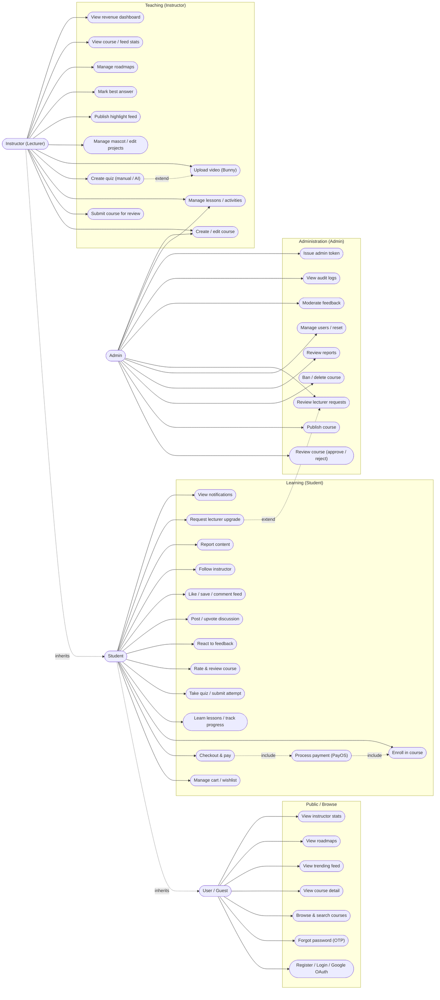

# Use Case Diagram

> Actors and use cases, verified against the API Gateway `access-policy.ts` role matrix
> and service controllers. Roles: ADMIN, STUDENT, LECTURER (+ unauthenticated Guest).
> Generated 2026-06-02.

Actor generalization: **Guest** ⟶ **Student** ⟶ **Instructor** (each inherits the
previous actor's use cases). **Admin** is a separate privileged actor.

## Actor capability summary

| Actor | Role | Representative capabilities |
|---|---|---|
| Guest | unauthenticated | register/login, browse & search courses, view course detail, trending feed, roadmaps, instructor stats |
| Student | STUDENT | + cart/wishlist, checkout & pay, enroll, learn & track progress, take quizzes, rate/react, discussions, feed interactions, follow instructors, report content, request lecturer upgrade, notifications |
| Instructor | LECTURER | + create/edit/submit courses, manage lessons & activities, create quizzes (incl. AI), upload videos, manage mascot/edit projects, publish highlight feed, mark best answer, manage roadmaps, view stats & revenue |
| Admin | ADMIN | review/approve/reject/publish/ban courses, review reports, manage users & reset, review lecturer requests, moderate feedback, view audit logs, issue admin token, plus course/lesson CRUD |

## Relationships

- `Checkout & pay` «include» `Process payment (PayOS)` «include» `Enroll in course`
  (enrollment is granted after the PayOS webhook confirms payment).
- `Create quiz (manual / AI)` «extend» `Upload video` (AI quiz generation uses the
  lesson video's SRT transcript).
- `Request lecturer upgrade` «extend» `Review lecturer requests` (admin acts on the request).
